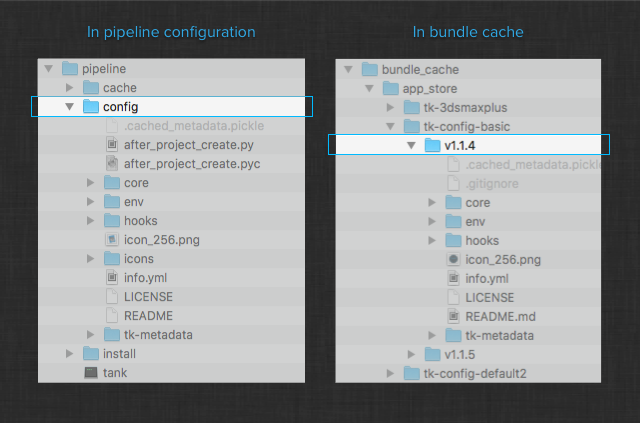

.. _descriptor:

.. currentmodule:: sgtk.descriptor

Descriptors
########################################

Descriptors are abstractions used to describe a remote piece of code or configuration.
They handle caching of remote resources locally, making it easy to write workflows
around installation and deployment.

.. note:: The Toolkit descriptor API does not require an installed or
    bootstrapped instance of the Toolkit Core platform. You can use it
    simply by importing ``sgtk`` and calling its methods.

Descriptors are used extensively by Toolkit and allow a user to configure and drive
Toolkit in a flexible fashion. Descriptors typically point at a remote location
and makes it easy to handle code transport from that location into a local cache.
Descriptors form the backbone for Shotgun deployment and installation. The following
example shows basic usage::

    import sgtk
    from sgtk.descriptor import Descriptor

    # first, authenticate our user
    sg_auth = sgtk.authentication.ShotgunAuthenticator()
    user = sg_auth.get_user()
    sg = user.create_sg_connection()

    # we are fetching v1.2.3 of the default config from the app store
    uri = "sgtk:descriptor:app_store?name=tk-config-basic&version=v1.2.3"

    # create object
    desc = sgtk.descriptor.create_descriptor(sg, Descriptor.CONFIG, uri)

    # make sure this is cached locally on disk
    desc.ensure_local()

    # check if it is the latest version
    latest_desc = desc.find_latest_version()

    # see what core is needed for this config
    required_core_uri = desc.associated_core_descriptor

When descriptors serialized, they can have two different forms:

- A descriptor URI is a compact string representation, for example
  ``sgtk:descriptor:app_store?name=tk-config-default&version=v1.2.3``

- A descriptor dictionary contains the equivalent information in key-value pair form::

    {
        "type": "app_store",
        "version": "v1.2.3",
        "name": "tk-config-default"
    }

.. note:: To convert between descriptor URI format and dictionary format, you can use
    the methods :meth:`descriptor_dict_to_uri` and :meth:`descriptor_uri_to_dict`.

When a the payload of a descriptor is downloaded, it ends up by default in the **global bundle cache**.

.. note:: The global bundle cache can be found in the following locations:

    - Macosx: ``~/Library/Caches/Shotgun/bundle_cache``
    - Windows: ``%APPDATA%\Shotgun\Caches\bundle_cache``
    - Linux: ``~/.shotgun/caches/bundle_cache``

    Unless specified otherwise, this is the location where descriptors will be
    cached locally.

    Older versions of Toolkit Core (prior to v0.18) used to maintain a bundle cache
    in an ``install`` folder inside the pipeline configuration location.

In addition to the location above, you can specify additional folders where the
descriptor API will go and look for cached items. This is useful if you want to
pre-cache an environment for your studio or distribute a set of app and engine
versions as an installable package that require no further retrieval in order
to function.

Alternatively, you can set the ``SHOTGUN_BUNDLE_CACHE_PATH`` environment variable to
a cache path on disk. This override helps facilitate workflows that require a
centralized disk location to which the descriptors are cached.

Descriptor types
----------------------------------------

Several different descriptor types are supported by Toolkit:

- An **app_store** descriptor represents an item in the Toolkit App Store
- A **shotgun** descriptor represents an item stored in Shotgun
- A **git** descriptor represents a tag in a git repository
- A **git_branch** descriptor represents a commit in a git branch
- A **path** descriptor represents a location on disk
- A **dev** descriptor represents a developer sandbox
- A **manual** descriptor gives raw access to the bundle caching structure

The descriptor API knows how to access and locally cache each of the types above.
You can control the location where the API caches items and supply additional lookup
locations if you want to pre-bake your own collection of caches.
Descriptors that are downloaded (cached) to the local disk are called **downloadable** descriptors.
The **app_store**, **shotgun**, **git** and **git_branch** descriptors are downloadable descriptors,
while the **path**, **dev** and **manual** descriptors are accessed directly from the specified path.

.. _app_store_descriptor:

The Shotgun App store
=====================

The Shotgun app store is used to release and distribute versions of Apps, Engines, Configs etc. that have been
tested and approved by Shotgun. App store descriptors should include a name and version token and
are on the following form:

.. code-block:: yaml

    {
        type: app_store,
        name: tk-core,
        version: v12.3.4
    }

.. code-block:: yaml

    sgtk:descriptor:app_store?name=tk-core&version=v12.3.4

App store may also have an optional ``label`` parameter. This indicates that the descriptor is tracking
against a particular label in the app store and will not download updates which do not have the label assigned:

.. code-block:: yaml

    {
        type: app_store,
        name: tk-core,
        version: v12.3.4,
        label: v2018.3
    }

.. code-block:: yaml

    sgtk:descriptor:app_store?name=tk-core&version=v12.3.4&label=v2018.3

A label can for example be used by plugins that are bundled with DCCs to only receive app store updates
targeting that particular DCC version. If you for example are running a plugin bundled together with
v2017 of a DCC, the plugin can be set up to track against the latest released version of
``sgtk:descriptor:app_store?name=tk-config-dcc&label=v2017``. In this case, when the descriptor is checking
for the latest available version in the app store, only versions labelled with v2017 will be taken into account.

.. _git_descriptors:

Tracking against tags in git
=============================

The ``git`` descriptor type is used to track git tags and typically used when you are tracking released
versions of something. You can use any syntax that git supports, with a path key containing the path
to the git repository.

Git repository residing on the local file system:

.. code-block:: yaml

    {
        type: git,
        path: /path/to/repo.git,
        version: v0.2.1
    }

.. code-block:: yaml

    sgtk:descriptor:git?path=/path/to/repo.git&version=v12.3.4

SSH git syntax:

.. code-block:: yaml

    {
        type: git,
        path: user@remotehost:/path_to/repo.git,
        version: v0.1.0
    }

.. code-block:: yaml

    sgtk:descriptor:git?path=user@remotehost:/path_to/repo.git&version=v0.1.0

Git protocol syntax:

.. code-block:: yaml

    {
        type: git,
        path: git://github.com/user/tk-multi-publish.git,
        version: v0.1.0
    }

.. code-block:: yaml

    sgtk:descriptor:git?path=git://github.com/user/tk-multi-publish.git&version=v0.1.0

Http protocol syntax:

.. code-block:: yaml

    {
        type: git,
        path: https://github.com/user/tk-multi-publish.git,
        version: v0.1.0
    }

.. code-block:: yaml

    sgtk:descriptor:git?path=https://github.com/user/tk-multi-publish.git&version=v0.1.0

.. note:: The latest version for a descriptor is determined by retrieving the list of tags for
    the repository and comparing the version numbers in order to determine the highest one.
    For this comparison, :py:class:`~distutils.version.LooseVersion` is used and we recommend
    that version numbers follow the semantic versioning standard that can be found at http://semver.org.

Tracking against commits in a git branch
========================================

The ``git_branch`` descriptor type is typically used during development and allows you to track
a commit in a particular branch.

Git repository residing on the local file system:

.. code-block:: yaml

    {
        type: git_branch,
        branch: master,
        path: /path/to/repo.git,
        version: 17fedd8
    }

.. code-block:: yaml

    sgtk:descriptor:git_branch?branch=master&path=/path/to/repo.git&version=17fedd8

SSH git syntax:

.. code-block:: yaml

    {
        type: git_branch,
        branch: master,
        path: user@remotehost:/path_to/repo.git,
        version: 17fedd8
    }

.. code-block:: yaml

    sgtk:descriptor:git_branch?branch=master&path=user@remotehost:/path_to/repo.git&version=17fedd8

Git protocol syntax:

.. code-block:: yaml

    {
        type: git_branch,
        branch: master,
        path: git://github.com/user/tk-multi-publish.git,
        version: 17fedd8
    }

.. code-block:: yaml

    sgtk:descriptor:git_branch?branch=master&path=git://github.com/user/tk-multi-publish.git&version=17fedd8

Http protocol syntax:

.. code-block:: yaml

    {
        type: git_branch,
        branch: master,
        path: https://github.com/user/tk-multi-publish.git,
        version: 17fedd8
    }

.. code-block:: yaml

    sgtk:descriptor:git_branch?branch=master&path=https://github.com/user/tk-multi-publish.git&version=17fedd8

You can use both long and short hash formats for the version token. The latest version for a git_branch
descriptor is defined as the most recent commit for a given branch.

.. warning:: Repositories requiring authentication are not fully supported by Toolkit. For such
             setups, we strongly recommend using an ssh style git url
             (e.g. ``git@github.com:shotgunsoftware/tk-core.git``) in order to eliminate git
             trying to prompt for a password in the background.

.. note:: On Windows, it is recommended that you use forward slashes.

.. note:: When using the git descriptor, you need to have the git executable in
          the ``PATH`` in order for the API to be able to do a latest check or
          app download. The git executable is, however, not needed during descriptor
          resolve and normal operation.

Pointing to a path on disk
==========================

Pointing Toolkit to an app that resides in the local file system is often very useful for managing your own bundles
or doing development on an app or engine before releasing onto production. To allow for these scenarios, Toolkit
provides the ``dev`` and ``path`` descriptors.

.. note:: ``dev`` and ``path`` descriptors are using the exact same syntax. The difference between them is that
    the ``dev`` descriptor indicates that development is happening and Toolkit will use this to enable developer
    related functionality at runtime, such as making available options to automatically reload the code at runtime.
    For production deploys, always use the ``path`` descriptor.

Basic example with a path intended to be used on the local operating system - the typical setup for doing
personal development:

.. code-block:: yaml

    {
        type: dev,
        path: /path/to/app
    }

.. code-block:: yaml

    sgtk:descriptor:dev?path=/path/to/app

When using a ``path`` descriptor in production, you can include paths to multiple different operating systems:

.. code-block:: yaml

    {
        type: path,
        windows_path: c:\path\to\app,
        linux_path: /path/to/app,
        mac_path: /path/to/app
    }

.. code-block:: yaml

    sgtk:descriptor:path?linux_path=/path/to/app&mac_path=/path/to/app&windows_path=c:\path\to\app

Environment variables can be included in paths:

.. code-block:: yaml

    {
        type: dev,
        path: ${HOME}/path/to/app
    }

.. code-block:: yaml

    sgtk:descriptor:dev?path=%24%7BHOME%7D/path/to/app

Home directory `~` syntax will be expanded:

.. code-block:: yaml

    {
        type: path,
        path: ~/path/to/app
    }

.. code-block:: yaml

    sgtk:descriptor:path?path=%7E/path/to/app

.. note:: Special characters are escaped for uri string compatibility

Sometimes it may be useful to distribute application code within the configuration for applications
that may not be accessible through the traditional distribution mechanism for Toolkit applications
like the :ref:`App Store<app_store_descriptor>` or the various :ref:`Git<git_descriptors>`
descriptor types. Although we recommend in those case to use the :ref:`local bundle
caches<local_bundle_caches>`, it may not always be desirable. In those cases, it is possible to
package the application code alongside the ``env`` or ``hooks`` folder and refer to it with the
``CONFIG_FOLDER`` token:

.. code-block:: yaml

    {
        type: dev,
        path: {CONFIG_FOLDER}/dev/tk-nuke-myapp
    }

.. code-block:: yaml

    sgtk:descriptor:dev?path=%7BCONFIG_FOLDER%7D/dev/tk-nuke-myapp

When using an installed pipeline configuration, this will refer to
``{PIPELINE_ROOT}/config``. When using a cached or baked pipeline configuration, it will point where
the bundle was found in one of the bundle caches.

.. note::
    If you don't know if your configuration will be used with an installed, baked or cached pipeline
    configuration, we recommend the use of the ``CONFIG_FOLDER`` token as it allows to resolve where
    the configuration's files will be located as the pipeline configuration may or may not contain
    the ``config`` folder depending on usage.

When using an installed pipeline configuration, it can be useful to organize your development
sandbox relative to a pipeline configuration. If all developers in the studio share a convention
where they for example have a ``dev`` folder inside their pipeline configuration dev sandboxes, it
becomes easy to exchange environment configs. You can achieve this by using the special token
``{PIPELINE_CONFIG}`` which will resolve into the local path to the pipeline configuration:

.. code-block:: yaml

    {
        type: dev,
        path: {PIPELINE_CONFIG}/dev/tk-nuke-myapp
    }

.. code-block:: yaml

    sgtk:descriptor:dev?path=%7BPIPELINE_CONFIG%7D/dev/tk-nuke-myapp

.. note::
    The ``PIPELINE_CONFIG`` refers to the root of the pipeline configuration, which for cached or baked
    pipeline configurations do not contain the ``config`` folder with all the environment and hook files.
    If you wish to refer to elements inside the ``config`` folder and wish the configuration to be usable
    both with installed, baked or cached configuration, we recommend you use the ``CONFIG_FOLDER`` token.

Pointing at a file attachment in Shotgun
============================================

The Shotgun descriptor allows you to upload an attachment directly
to Shotgun and then reference it with a descriptor.

This allows for workflows where you can distribute configurations, custom apps
or other items to your distributed users - regardless of network or file access.
All they need is a connection to Shotgun.

A practical application of this is Toolkit's cloud based configurations;
Upload a zipped toolkit configuration to the ``PipelineConfiguration.uploaded_config`` field on your pipeline configuration.
The :class:`~sgtk.bootstrap.ToolkitManager` bootstrapping interface will automatically detect
this, download the configuration locally and use this when launching.
This allows for a powerful workflow where a configuration is simply
uploaded to Shotgun and it gets automatically picked up by all
users (even if they are remote).

The Shotgun descriptor is the low level mechanism that is used to implement the cloud
configurations described above. The descriptor points at a particular attachment
field in Shotgun and expects a zip file to be uploaded to the field.

Two formats are supported, one explicit based on a shotgun entity id and
one implicit which uses the name in shotgun to resolve a record. With the
id based syntax you specify the Shotgun entity type and field name you want
to look for and the entity id to inspect. For example, if your attachment field is called
``PipelineConfiguration.uploaded_config`` and you want to access the uploaded payload for
the Pipeline Configuration entity with id 111, use the following descriptor:

.. code-block:: yaml

    {
        type: shotgun,
        entity_type: PipelineConfiguration,  # entity type
        id: 111,                             # shotgun entity id
        field: uploaded_config,              # attachment field where payload can be found
        version: 222                         # attachment id of particular attachment
    }

.. code-block:: yaml

    sgtk:descriptor:shotgun?entity_type=PipelineConfiguration&id=111&field=sg_config&version=222

The version token above refers to the version of the attachment. Every time a new
attachment is uploaded to Shotgun, it gets assigned a unique id and the version
number in the descriptor allows you to point at a particular version of an uploaded
attachment. It is also used to handle the underlying logic to understand what the
latest version of an attachment is.

In some workflows, typically where you follow name based naming conventions, the
following syntax can be useful:

.. code-block:: yaml

    {
        type: shotgun,
        entity_type: PipelineConfiguration,  # entity type
        name: Primary,                       # name of the record in shotgun (e.g. 'code' field)
        project_id: 123,                     # optional project id. If omitted, name is assumed to be unique.
        field: uploaded_config,              # attachment field where payload can be found
        version: 456                         # attachment id of particular attachment
    }

.. code-block:: yaml

    sgtk:descriptor:shotgun?entity_type=PipelineConfiguration&name=primary&project_id=123&field=sg_config&version=456

Here, instead of specifying the entity id you can specify a ``name`` and an optional ``project_id`` field. The name
field will be translated into an appropriate Shotgun name field, typically the ``code`` field.

Manual Descriptors
=======================

Toolkit also provides a ``manual`` mode to make it easy to manage production installations of apps
and engines without any automation. When you use the manual descriptor, it is up to you to install the code in the right
location and no automated update checks will ever take place. The manual mode uses the following syntax:

.. code-block:: yaml

    {
        type: manual,
        name: tk-nuke-publish,
        version: v0.5.0
    }

.. code-block:: yaml

    sgtk:descriptor:manual?name=tk-nuke-publish&version=v0.5.0

It will look for the code in a ``manual`` folder in the bundle cache, so with the example above, Toolkit would look
for the code in the ``BUNDLE_CACHE/manual/tk-nuke-publish/v0.5.0`` folder.

.. warning:: Manual descriptors are part of an older toolkit workflow methodology and while they are supported,
    we do not recommend using them.

Environment Variables
===============================================

A number of different environment variables exist to help control the behavior of Descriptors:

=================================== ===========================================================================
Environment Variable Name           Description
=================================== ===========================================================================
SHOTGUN_HOME                        Overrides the location where Toolkit stores data. This includes bootstrap
                                    data as well as bundle cache, cached thumbnails and other temp files.

SHOTGUN_BUNDLE_CACHE_PATH           Overrides the path to the main bundle cache, e.g. the location where
                                    the :ref:`Descriptor URI<descriptor>` will download bundles.

SHOTGUN_BUNDLE_CACHE_FALLBACK_PATHS Colon separated list of paths to look for bundle cache locations. This is
                                    for example useful if you maintain a centralized bundle cache location
                                    that you want the bootstrap API to pick up bundles from.

SHOTGUN_DISABLE_APPSTORE_ACCESS     Setting this to ``1`` will disable any Shotgun Appstore access. No attempts
                                    to connect will be carried out. This option can be useful in cases where
                                    complex proxy setups is preventing Toolkit to correctly operate.

=================================== ===========================================================================

API reference
----------------------------------------

Factory Methods
================================================

.. autofunction:: create_descriptor
.. autofunction:: descriptor_dict_to_uri
.. autofunction:: descriptor_uri_to_dict
.. autofunction:: is_descriptor_version_missing

AppDescriptor
================================================

.. autoclass:: AppDescriptor
    :inherited-members:
    :members:
    :exclude-members: create, register_descriptor_factory

EngineDescriptor
================================================

.. autoclass:: EngineDescriptor
    :inherited-members:
    :members:
    :exclude-members: create, register_descriptor_factory

FrameworkDescriptor
================================================

.. autoclass:: FrameworkDescriptor
    :inherited-members:
    :members:
    :exclude-members: create, register_descriptor_factory

ConfigDescriptor
================================================

.. autoclass:: ConfigDescriptor
    :inherited-members:
    :members:
    :exclude-members: get_config_folder,
        resolve_core_descriptor,
        create,
        register_descriptor_factory

CoreDescriptor
================================================

.. autoclass:: CoreDescriptor
    :inherited-members:
    :members:
    :exclude-members: get_features_info,
        create,
        register_descriptor_factory

Exceptions
================================================

.. autoclass:: TankDescriptorError
    :show-inheritance:
    :inherited-members:
    :members:

.. autoclass:: TankAppStoreError
    :show-inheritance:
    :inherited-members:
    :members:

.. autoclass:: TankAppStoreConnectionError
    :show-inheritance:
    :inherited-members:
    :members:

.. autoclass:: TankInvalidAppStoreCredentialsError
    :show-inheritance:
    :inherited-members:
    :members:

.. autoclass:: TankInvalidAppStoreCredentialsError
    :show-inheritance:
    :inherited-members:
    :members:

.. autoclass:: TankCheckVersionConstraintsError
    :show-inheritance:
    :inherited-members:
    :members:

.. autoclass:: TankInvalidInterpreterLocationError
    :show-inheritance:
    :inherited-members:
    :members:

.. autoclass:: TankMissingManifestError
    :show-inheritance:
    :inherited-members:
    :members:
