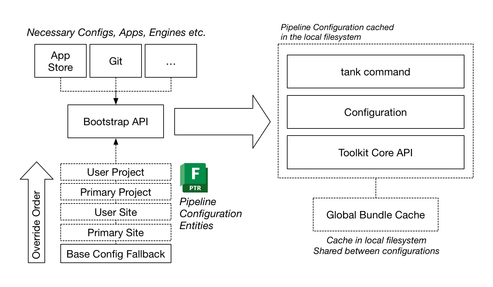
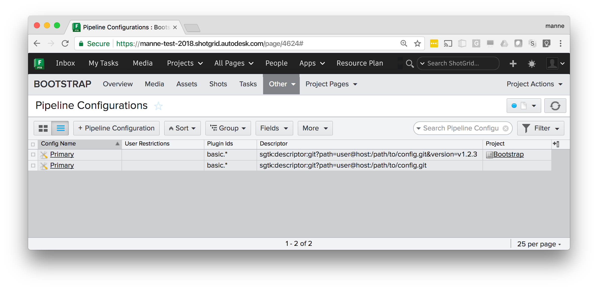

.. _init_and_startup:

Initialization and startup
########################################

This section outlines how Toolkit starts up and initializes. It explains the common
patterns which exist around startup, configuration management and the various
APIs and workflows which are related to this process.

Introduction
----------------------------------

Toolkit is organized into an arrangement of *Pipeline Configurations*.
Each Project in Shotgun can have one or more Pipeline Configuration entities associated.
Each of these have an associated location on disk which contains all the pieces needed
to execute locally.

.. image:: ./resources/initializing/tk_project.png
    :width: 500px
    :align: center

The Pipeline Configuration on disk contains the following items:

- A configuration. This contains all the the details that define the configuration:
  what version of the Core API to use, what versions of apps and engines,
  the naming convention and templates to use.

- A version of the core API as defined by the configuration.

- A ``tank`` command which gives access to admin and maintenance commands to
  make it easy to upgrade and configure the configuration. It also gives
  access to the shell engine environment.

- The bundle cache, contained inside an ``install`` folder, contains
  downloaded apps, frameworks and engines defined by the configuration.
  This cache is dowloaded from locations such as the Shotgun App Store,
  git or from your Shotgun site, all handled by the :ref:`descriptor` system.

With this arrangement, each pipeline configuration in Toolkit has its own
independent API and configuration, making it easy to customize different
projects differently and evolve the pipeline over time.

The main Pipeline Configuration entity for a project is always named ``Primary``.
In addition to this, additional pipeline configurations can
be set up. Typically, these are used as test areas or developer sandboxes, where you
want to run a special version of the configuration. Configurations can be associated
with certain users to limit visibility and make it easy to run development and testing
in parallel with production.

.. note:: To read more about the default configurations offered with Toolkit, see
    the `Shotgun integrations admin guide <https://support.shotgunsoftware.com/hc/en-us/articles/115000067493-Integrations-Admin-Guide>`_.

When Toolkit starts up
-------------------------------------------

In order to understand how the Toolkit startup APIs operate,
let's begin by taking a look at how the default Toolkit configuration
operates at a high level:

.. image:: ./resources/initializing/launch.png
    :width: 700px
    :align: center

This design is repeated everywhere and is a pattern which can be easily extended.
Users typically launch Toolkit by launching the Shotgun Desktop. The Shotgun Desktop - seen
on the left hand side in the figure shown above -
contains a *Toolkit plugin* which runs the :ref:`bootstrap_api` in order to load in a
full Toolkit environment.

The Bootstrap API will prompt the user to log in to a site. Next, it will connect to
the site to see if any Pipeline Configuration Entities have been configured.
If so, these are used to configure Shotgun Desktop. If not,
the plugin logic will fall back on looking for the latest release of the ``tk-config-basic``
configuration in the Shotgun App Store.

The bootstrap API will make the necessary preparations and then launch the Toolkit :ref:`Engine <engines>`,
which in turn will enumerate the apps defined in the configuration. Especially note
the *Launch App* which is designed to launch other software. This app makes use of
a standard :ref:`Launch API<launching_software>` provided by ``tk-core``. The launch app
will use this API to detect the path to the software, launch it, and ensure that upon launch,
the toolkit plugin associated with that software is loaded at startup so that the Toolkit
integrations activate automatically.
Each toolkit engine (Maya, Nuke, Houdini, etc) then contains its own Toolkit plugin which
when activated will start the Toolkit bootstrap API and start up the appropriate
configuration.

.. note:: This pattern is very flexible and toolkit plugins can be crafted
    in many different ways, to be auto updating or fixed, to be distributed with
    an engine or be completely stand alone. Similarly, the :ref:`bootstrap_api`
    is merely a mechanism that allows a user to load a pipeline configuration and
    launch an engine and can be run in many different scenarios, not just contained
    inside a plugin.

Shotgun Pipeline Configurations
-------------------------------------------

As we have seen above, it is the responsibility of the :ref:`bootstrap_api` to initiate
the Toolkit session. The API handles all the complexity of different setups
and configurations and we recommend you always use it to launch Toolkit when possible.

By default, the boostrap will connect to the Shotgun site during launch to look for
Pipeline Configurations in several different ways (documented below). As shown in
the previous section, if no suitable Pipeline Configuration Entity exists in Shotgun,
you can configure the bootstrap API to fall back on a default
:meth:`~sgtk.bootstrap.ToolkitManager.base_configuration`. This makes it possible to
create a workflow where a Toolkit plugin can operate even when no explicit pipeline
configuration has been defined in Shotgun.

.. note:: Toolkit is a platform executing python code locally on your machine. This
    means that all code for apps and engines need to be downloaded locally before
    the Toolkit session can be started. Setting up this toolkit configuration on disk
    and ensuring that all necessary dependencies exist locally is one of the main
    responsibilities of the :ref:`bootstrap_api`.

When creating pipeline configuration entities in Shotgun, there are two fundamentally
different ways to do this:

- You **create a Shotgun Pipeline Configuration entity** for your project.
  This is then detected by the Bootstrap API which will automatically manage your local
  configuration on disk, ensuring that you have all the right dependencies needed to
  run the configuration. This is by default a decentralized where each user manages its
  own set of configuration data.

- Via toolkit's **project setup** system, you create a centralized toolkit configuration
  in a specific location on disk. After project setup, all management of this
  configuration is manual and all users who want to access the pipeline confguration
  needs to be able to access its disk location.

Both workflows are documented below.

.. _automatically_managed_pcs:

Automatically managed pipeline configurations
-----------------------------------------------

In order to configure an automatically managed configuration, create an
entity in Shotgun to represent a ``Primary`` configuration:

.. image:: ./resources/initializing/pipeline_config.png
    :align: center

The descriptor field contains a :ref:`Descriptor Uri<descriptor>` pointing at a
configuration. The bootstrap API will detect this and use it as it starts up
toolkit for this particular project. This is a decentralized workflow; every
user will maintain their own configuration, meaning that you
don't need a central storage.

.. note:: Files are by default downloaded into ``%APPDATA%\Shotgun`` (Windows),
    ``~/Library/Caches/Shotgun`` (Mac) and ``~/.shotgun`` (Linux), but these locations
    can be customized by setting a ``SHOTGUN_HOME`` :ref:`environment variable<environment_variables>`.

When the bootstrap API starts up, it goes through a series of steps:

First, the configuration to use will be determined. The bootstrap will look for
Shotgun Pipeline configuration in the following order:

- A Pipeline Config for the current project, associated with the user. These are
  typically dev or test sandboxes.
- A ``Primary`` Pipeline Config associated with the current project.
- A site-wide Pipeline Config (e.g. with the Project field blank) associated with the user.
- A site-wide ``Primary`` Pipeline Config
- If none of the above is found, :meth:`~sgtk.bootstrap.ToolkitManager.base_configuration` is used.

.. note:: You can also build a bootstrap setup which enumerates all pipeline
    configurations available and lets the user select which one to use. This
    is how Shotgun Desktop works.

Once the Pipeline Configuration has been determined, its descriptor is resolved, downloaded and
all its dependencies (Apps, Engines, Core, Frameworks) are downloaded. All these items
are downloaded into a global bundle cache which by default resides locally on a user's machine
but is shared between all pipeline configurations.

Lastly, it creates a Pipeline Configuration on disk, from which toolkit is launched.

.. note:: The end result of starting Toolkit using the bootstrap API and using the Manual
    project setup is exactly the same. The difference is that when using Project Setup,
    the Pipeline Configuration on disk is created at the start of a project and shared
    between all users. When using the bootstrap API, the pipeline configuration on disk
    is created just-in-time prior to launch, based on the Pipeline Configuration settings
    in Shotgun.

Uploading a Configuration to Shotgun
===============================================

If you don't want to manage your pipeline using git version control yet want a simple way
to distribute a Toolkit configuration to a group of distributed users, it is also possible
to upload the configuration as an attachment to Shotgun. This is a simple and powerful
workflow. To do this, start by creating a custom field on the Pipeline Configuration called
``sg_uploaded_config``:

Once created, you can zip up your configuration and upload it as an attachment. Make sure
you leave the descriptor field blank:

.. image:: ./resources/initializing/zip_config.png
    :width: 700px
    :align: center

The Bootstrap will automatically download the configuration. If a new configuration
is uploaded, all users will pick that up the next time they run the boostrap.

.. note:: As an example, you can download one of the default configurations from
    github as a zip and upload it as an attachment from Shotgun:
    https://github.com/shotgunsoftware/tk-config-basic/archive/master.zip

Examples of Pipeline Configurations
===============================================

Below are a collection of practical examples for how Pipeline Configurations can be set up.
Each Pipeline Configuration uses a :ref:`Descriptor Uri<descriptor>` to specify where the
configuration should be downloaded from. For full technical details, see the
Descriptor documentation.

Fixing a version for a project
~~~~~~~~~~~~~~~~~~~~~~~~~~~~~~~~~

.. image:: ./resources/initializing/pipeline_config.png
    :width: 700px
    :align: center

All users in the current project will be a fixed version of the ``tk-config-basic`` configuration
from the Shotgun App Store. This can be useful if you don't want a project to auto update. Omitting
the version number, e.g. ``sgtk:descriptor:app_store?name=tk-config-basic`` will resolve to the most
recent version number.

Git site and project configurations
~~~~~~~~~~~~~~~~~~~~~~~~~~~~~~~~~~~~~

This example shows several things. The Pipeline Configuration without a Project set is a site
wide configuration - it will be used by all projects except the Bootstrap project, which has a
specific configuration defined. The Bootstrap project will use tag `v1.2.3` from the specified
git repository, whereas all other projects will use the tag with the highest version number.
Below are additional examples of how git repositories can be specified:

- Highest tag in a git repository: ``sgtk:descriptor:git?path=user@host:/path/to/config.git``
- Specific tag in a git repository: ``sgtk:descriptor:git?path=user@host:/path/to/config.git&version=v1.2.3``
- Latest commit in a git branch:
  ``sgtk:descriptor:git_branch?path=user@host:/path/to/config.git&branch=master``
- Specific commit in a git branch:
  ``sgtk:descriptor:git_branch?path=user@host:/path/to/config.git&branch=master&version=17fedd8``

Developer sandbox
~~~~~~~~~~~~~~~~~~~~~~~~~~~~~~~~~~~~~

This example shows a typical development/test setup - alongside the Primary configuraton for the project
there is a dev sandbox. All user associated with that dev sandbox will pick that up instead of the
default one, making it easy to 'invite' users in for testing. (In Shotgun Desktop, a dropdown will appear,
allowing a user to choose which config to use). A ``dev`` descriptor is used to point at a local dev area on disk.

.. note:: For ``git`` based workflows, all users need to have git installed.

.. note:: For more information about descriptors, see the :ref:`API Reference<descriptor>`.

Plugins and plugin ids
===============================================

In each of the examples shown above, there is a **Plugin Ids** field set to ``basic.*``:

.. image:: ./resources/initializing/pipeline_config.png
    :width: 700px
    :align: center

This field is used to specify the *scope* where the configuration should be used. Each Toolkit plugin and
script using the :ref:`bootstrap_api` specifies a :meth:`~sgtk.bootstrap.ToolkitManager.plugin_id`.
All default Toolkit engines and integrations are using a ``basic`` prefix, e.g. the Maya engine has got
a plugin id of ``basic.maya``, Nuke is ``basic.nuke`` etc.

By specifying ``basic.*`` in the *plugin Ids* field on the Pipeline Configuration, the configuraiton will be
used by all the default (basic) toolkit integrations. If you wanted a special configuration to only apply
to certaing software integrations, you can specify this:

The above configuration will only be used when the Maya and Nuke plugins bootstrap.

.. note:: If you don't specify a plugin id for your Pipeline Configuration, it will be ignored
    by the boostrap. We recommend using ``basic.*`` as a default.

Manual Pipeline Configuration via Project Setup
-------------------------------------------------

A manual project is either done via the Shotgun Desktop Project Setup Wizard or through the ``tank setup_project``
command. During this process, you will choose a location on disk for your configuration. Make sure you
choose a location in disk which is accessible by all users who wants to access the configuration (e.g.
typically on a fast, shared storage). The figure below illustrates the process:

.. image:: ./resources/initializing/manual_install.png
    :width: 700px
    :align: center

The ``tank setup_project`` command will create a ``Primary`` pipeline configuraiton entity in Shotgun and a
full configuration on disk. App, Engine and other payload is downloaded into the *bundle cache*
contained by the config. The three fields ``windows_path``, ``mac_path`` and ``linux_path`` are populated
with paths to the configuration on disk.

- Once the setup completes, maintenance and updates are completely manual, typically via ``tank`` commands
  such as ``tank core`` and ``tank updates``.
- Typically, a configuration is created in **localized** mode, meaning that it keeps it's own core and
  bundle cache as part of the configuration. It is also possible to share the core and the bundle cache
  with other configurations by creating a *shared core*.
- In order to create additional configurations beyond the ``Primary`` one (for example for
  developemnt or upgrade testing), right click on the configuration in Shotgun and choose
  the **Clone Configuration** option.

.. note:: This is the workflow that was exclusively used by all toolkit versions prior to
    core v0.18, when the bootstrap API was introduced. It will continue to be supported,
    however it is less flexible than the more automatic workflows and can be especially
    challenging when you have a setup which doesn't have a centralized storage. We
    recommend using :ref:`automatic configurations<automatically_managed_pcs>` whenever possible.

Starting a Toolkit engine from a manual project
===============================================

In this case, when a known location exists for your core API, you are not required to use the
bootstrap API, however you still can. In order to launch a maya engine using the bootrap API,
you would simply execute:

.. code-block:: python

    import sgtk

    # Start up a Toolkit Manager
    mgr = sgtk.bootstrap.ToolkitManager()

    # now start up the maya engine for a given Shotgun object
    e = mgr.bootstrap_engine("tk-maya", entity={"type": "Project", "id": 122})

.. note:: When using boostrap, any ``tk-core`` API can be used for the initial ``import sgtk``.
    The bootstrap API will automatically determine which version is required for the project
    we are bootstrapping into, and potentially swap the core at runtime if the project
    requires a more recent version than the one used to bootstrap with.

Given that the location of the configuration is known on beforehand, factory methods
such as :meth:`sgtk.sgtk_from_path` can also be used, however when doing so you need
to make sure you use the core assocaited with the configuration:

.. code-block:: python

    # our configuration is installed in /mnt/toolkit/configs/hidden_forest

    # add the core of the project to the pythonpath
    import sys
    sys.path.append("/mnt/toolkit/configs/hidden_forest/install/core/python")

    # now import the API associated with config
    import sgtk

    # and start up the main tk API
    tk = sgtk.sgtk_from_path("/mnt/toolkit/configs/hidden_forest")

    # create a context
    ctx = tk.context_from_entity("Project", 122)

    # launch the engine
    engine = sgtk.platform.start_engine("tk-maya", tk, ctx)

.. _bootstrap_api:

Bootstrap API
----------------------------------------

.. currentmodule:: sgtk.bootstrap

The :class:`ToolkitManager` class allows for run-time handling of Toolkit configurations
and removes the traditional step of a project setup. Instead, you can launch an engine
directly based on a configuration :ref:`Descriptor Uri<descriptor>`. The manager encapsulates
the configuration setup process and makes it easy to create a running instance of
Toolkit. It allows for several advanced use cases:

- Bootstrapping via the Toolkit manager does not require anything to be
  set up or configured in Shotgun. No extensive project setup step is required.

- A setup can be pre-bundled with for example an application plugin, allowing
  Toolkit to act as a distribution platform.

The following example code can for example run inside maya in order
to launch Toolkit's default config for a given Shotgun Asset:

.. code-block:: python

    import sgtk

    # Start up a Toolkit Manager
    mgr = sgtk.bootstrap.ToolkitManager()

    # Set the base configuration to the default config
    # Note that the version token is not specified, meaning that
    # the latest version will be looked up and used
    mgr.base_configuration = "sgtk:descriptor:app_store?name=tk-config-basic"

    # now start up the maya engine for a given Shotgun object
    e = mgr.bootstrap_engine("tk-maya", entity={"type": "Asset", "id": 1234})

In this rudimentary example, there is no need to construct any :class:`sgtk.Sgtk`
instance or run a ``tank`` command - the :class:`ToolkitManager` instead becomes the entry
point into the system. It will handle the setup and initialization of the configuration behind the scenes
and start up a Toolkit session once all the required pieces have been initialized and set up.

.. _environment_variables:

Environment Variables
===============================================

A number of different environment variables exist to help control the behavior of the Toolkit Startup:

=================================== ===========================================================================
Environment Variable Name           Description
=================================== ===========================================================================
SHOTGUN_HOME                        Overrides the location where Toolkit stores data.
                                    This includes bootstrap data as well as bundle cache,
                                    cached thumbnails and other temp files.

SHOTGUN_BUNDLE_CACHE_PATH           Overrides the path to the main bundle cache, e.g. the location where
                                    the :ref:`Descriptor Uri<descriptor>` will download bundles.

SHOTGUN_BUNDLE_CACHE_FALLBACK_PATHS Colon separated list of paths to look for bundle cache locations. This is
                                    for example useful if you maintain a centralized bundle cache location
                                    that you want the bootstrap API to pick up bundles from.

TK_BOOTSTRAP_CONFIG_OVERRIDE        Low level bypass to set the configuration desciptor URI that the bootstrap
                                    API should load up. Useful in complex workflow development scenarios.

SHOTGUN_DISABLE_APPSTORE_ACCESS     Setting this to ``1`` will disable any Shotgun Appstore access. No attempts
                                    to connect will be carried out. This option can be useful in cases where
                                    complex proxy setups is preventing Toolkit to correctly operate.

=================================== ===========================================================================

ToolkitManager
========================================

.. autoclass:: ToolkitManager
    :members:
    :inherited-members:
    :exclude-members: entry_point, set_progress_callback

Exception Classes
========================================

.. autoclass:: TankBootstrapError
    :show-inheritance:
    :inherited-members:
    :members:

Factory methods
----------------------------------------------------

.. currentmodule:: sgtk

For setups where the configuration resides in a specific location on disk, you can use
the following factory methods to create a :class:`sgtk.Sgtk` instance:

.. autofunction:: sgtk_from_path
.. autofunction:: sgtk_from_entity

.. note::
    You can also use the methods above in conjunction with projects handled
    by the :class:`~sgtk.bootstrap.ToolkitManager`, but since the location
    of the configuration of such projects isn't explicit and known beforehand,
    the factory methods are less useful in this context.

Installing the sgtk module using pip
----------------------------------------

When running Toolkit using the bootstrap API above, you need access to the :class:`ToolkitManager`
class in order to kickstart the bootstrap process. Once you have started the bootstrap, toolkit will
download all the necessary components for the given configuration you are bootstrapping into,
potentially even including a different version of the core API than you are using to bootstrap with.

In order to fully automate this process programatically, you need an ``sgtk`` instance to begin with.
One way to accomplish this is to use ``pip`` (see https://pip.pypa.io/). Use the following syntax::

    pip install git+https://github.com/shotgunsoftware/tk-core@v0.18.35

If you want to add an sgtk core to a ``requirements.txt`` file, use the following syntax::

    git+https://github.com/shotgunsoftware/tk-core@v0.18.35

.. warning:: In order to use ``pip``, you currently need to have the git executable installed
             on the system that you are deploying to.

.. warning:: We strongly recommend always providing a version number. Not providing a version
             number will currently download the latest commit from the master branch and
             associate it with the highest available version number tag. Such downloads are
             likely to contain changes which have not yet been full tested.

.. _launching_software:

Launching Software
---------------------------------------------------

.. currentmodule:: sgtk.platform

In order to run software integrations in the form of a Toolkit :class:`Engine`,
it is necessary to be able to easily launch the software and initialize Toolkit once
the software environment.

Toolkit offers a centralized set of APIs to make this task straight forward. Each engine
implements the following:

- How installed versions of the software are auto-detected
- How to launch the software and what environment to pass
- How to make sure the toolkit integration auto-loads once the software has launched.

.. note:: These APIs can be wrapped inside a Toolkit app or simliar in order
    to create a centralized launcher experience. The ``tk-multi-launchapp`` is
    an example of such an implementation.

A Simple Launch Application
===================================================

The Toolkit core API provides an interface that custom applications can use to implement the business
logic for launching DCC software related to a particular Toolkit engine. This interface is comprised
of a factory method :meth:`create_engine_launcher` and classes :class:`SoftwareLauncher`,
:class:`SoftwareVersion`, and :class:`LaunchInformation`. The factory method is called for a specific
engine in the environment configuration and returns a SoftwareLauncher subclass instance implemented
by that engine.

Methods on the launcher instance can be used to determine which versions of the DCC
are installed on the local filesystem and the proper environment, including command line arguments,
required for a successful launch.

The following lines of python code demonstrate how to launch Maya using the core interface:

.. code-block:: python

    import subprocess
    import sgtk

    # Create a Toolkit Core API instance based on a project path or
    # path that points directly at a pipeline configuration.
    tk = sgtk.sgtk_from_path("/site/project_root")

    # Specify the context the DCC will be started up in.
    context = tk.context_from_path("/site/project_root/sequences/AAA/ABC/Light/work")

    # Using a core factory method, construct a SoftwareLauncher
    # subclass for the desired tk engine.
    software_launcher = sgtk.platform.create_engine_launcher(tk, context, "tk-maya")

    # Use the SoftwareLauncher instance to find a list of Maya versions installed on the
    # local filesystem. A list of SoftwareVersion instances is returned.
    software_versions = software_launcher.get_supported_software()

    # Ask the SoftwareLauncher instance to prepare an environment to launch Maya in.
    # For simplicity, use the first version returned from the list of software_versions.
    launch_info = software_launcher.prepare_launch(software_versions[0].path)

    # Launch Maya!
    launch_command = "%s %s" % (launch_info.path, launch_info.args)
    subprocess.Popen([launch_command], env=launch_info.environment)

Engine Implementation
===================================================

If you are writing a Toolkit software integration (an Engine), you should include logic for
how the software is being launched and how Toolkit should initialize after launch. This is
done by providing a subclass of :class:`SoftwareLauncher`. This class should be
located in a ``startup.py`` file at the engine root level, analogous to the
``engine.py`` file.

In addition to this, we recommend a convention where the startup scripts that launch toolkit
once the software is running are located in a ``startup`` folder.

Two methods should be implemented in the ``startup.py`` file:

- The :meth:`SoftwareLauncher.scan_software` method is responsible for discovering the executable
  paths for the related software installed on the local filesystem and returns a list of
  :class:`SoftwareVersion` instances representing the executables found.

- The :meth:`SoftwareLauncher.prepare_launch` method will be called before launch. It should return a
  :class:`LaunchInformation` instance that contains all information required to successfully launch the
  DCC and startup the engine integration.

A basic ``startup.py`` file for the Maya engine would contain the following:

.. code-block:: python

    from sgtk.platform import SoftwareLauncher, SoftwareVersion, LaunchInformation

    class MayaLauncher(SoftwareLauncher):

        def scan_software(self):
            # Construct a list of SoftwareVersion instances
            # representing executable versions of the software
            # installed on the local filesystem. This can include
            # variations, icons, version numbers etc.
            software_versions = []
            ...
            return software_versions

        def prepare_launch(self, exec_path, args, file_to_open=None):
            # Construct an environment to launch the DCC in,
            # confirm the correct executable path to
            # launch, and provide required command line args.
            # Return this information as a
            # LaunchInformation instance.
            correct_executable_path = ""
            command_line_args = ""
            launch_environment = {}

            # once the software has launched, execute
            # startup script startup/userSetup.py
            launch_environment["PYTHONPATH"] = os.path.join(self.disk_location, "startup")

            # make sure to include some standard fields describing the current context and site
            std_env = self.get_standard_plugin_environment()
            launch_environment.update(std_env)

            launch_information = LaunchInformation(
                correct_executable_path,
                command_line_args,
                launch_environment
            )
            return launch_information

After software launch
~~~~~~~~~~~~~~~~~~~~~~~~~~~~~~~~~~~~~~~~~~~~

Note how the ``prepare_launch()`` method in the example above modifies
the ``PYTHONPATH``. Later on as Maya is launching, it will look for a
``userSetup.py`` file in the ``startup`` folder. This file can then launch
the actual toolkit integration, typically using the :class:`sgtk.bootstrap.ToolkitManager`
interfaces.

.. note:: How to initialize and run code at startup will vary from DCC to DCC.
    The supported toolkit engines for Maya, Nuke, and Houdini are good reference implementations.

Also note how the example code above calls :meth:`~SoftwareLauncher.get_standard_plugin_environment`.
This will include a set of default environment variables which can be picked up by the startup script
and initialize Toolkit with the correct site, context etc.

Settings and configuration
~~~~~~~~~~~~~~~~~~~~~~~~~~~~~~~~~~~~~~~~~~~~

You can access any engine settings defined in the environment using the
:meth:`SoftwareLauncher.get_setting` method. This means that you can create
a configurable launcher setup, following the exact same patterns that are used
for engine settings.

.. note:: If you need to pass a setting into your startup script, read it in using the
    :meth:`~SoftwareLauncher.get_setting` during :meth:`~SoftwareLauncher.prepare_launch` and
    pass it as an environment variable into your startup script.

Software Launch APIs
============================

This section contains the techincal documentation for the core classes and methods described in the
:ref:`Launching Software` section above.

.. autofunction:: create_engine_launcher

SoftwareLauncher
~~~~~~~~~~~~~~~~~~~~~~~~~~~~~~~~~~~~~~~~~~~~~~~~~~~

.. autoclass:: SoftwareLauncher
  :members:
  :exclude-members: descriptor,
                    settings

  The following methods can be used by subclasses to help implement :meth:`scan_software`.

  .. automethod:: _is_supported
  .. automethod:: _glob_and_match

SoftwareVersion
~~~~~~~~~~~~~~~~~~~~~~~~~~~~~~~~~~~~~~~~~~~~~~~~~~~

.. autoclass:: SoftwareVersion
    :members:

LaunchInformation
~~~~~~~~~~~~~~~~~~~~~~~~~~~~~~~~~~~~~~~~~~~~~~~~~~~

.. autoclass:: LaunchInformation
    :members:

