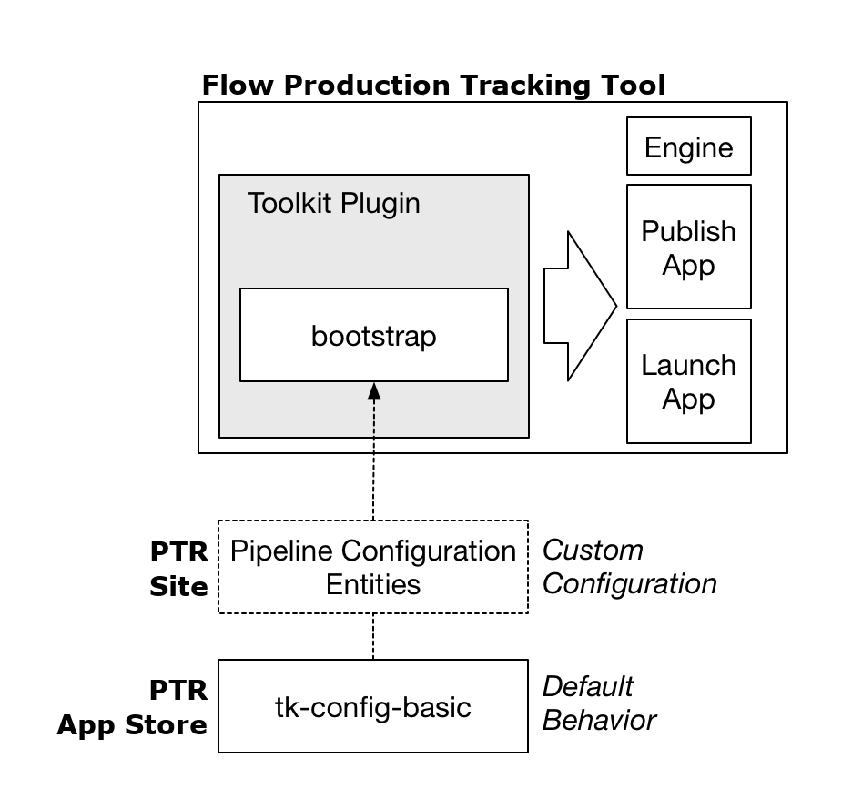
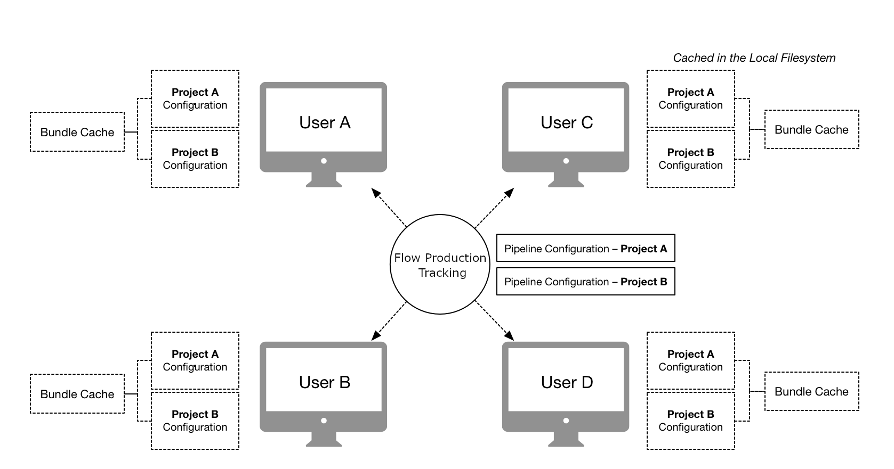
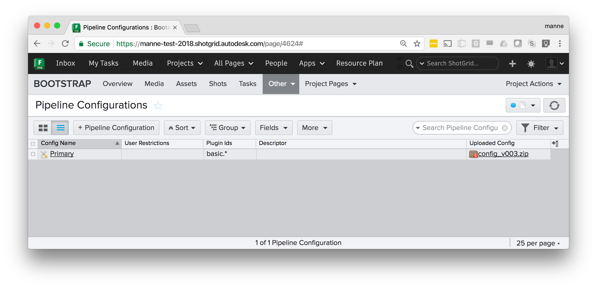

.. _init_and_startup:

Initialization and startup
########################################

This section outlines how Toolkit starts up and initializes. It explains the common
patterns around startup, configuration management and the various
APIs and workflows related to this process.

Introduction
----------------------------------

Toolkit is controlled using *Pipeline Configuration Entities*. Each Project in Shotgun can have one or
more of these entities associated. The Shotgun entity either contains Toolkit configuration settings
directly, or points to a location where these can be downloaded from.

When Toolkit starts up, it ensures that these configuration settings exists on disk, alongside
with all other necessary pieces required for Toolkit to operate. This collection of files
is referred to as a *Pipeline Configuration*.

The Pipeline Configuration on disk contains the following items:

- Configuration files - all the the details that define the configuration:
  app and engine settings, naming convention and file system templates.

- An installed version of the Toolkit Core API as required by the configuration.

- A ``tank`` command which gives access to admin and maintenance commands to
  make it easy to upgrade and configure the configuration. It also gives
  access to the shell engine environment.

- A so called bundle cache, contained inside an ``install`` folder, containing
  downloaded apps, frameworks and engines defined by the configuration.
  This cache is downloaded from locations such as the Shotgun App Store,
  git or from your Shotgun site, all handled by Toolkit's
  :ref:`Descriptor<descriptor>` system.

By default, each pipeline configuration in Toolkit has its own
independent API and configuration, making it easy to customize different
projects independently and evolve the pipeline over time without breaking older
projects. However, it is possible to arrange your configuration in several
different other ways, all explained below.

In Shotgun, the main Pipeline Configuration Entity for a project is always named ``Primary``.
In addition to this, additional pipeline configurations entities can
be set up. Typically, these are used as test areas or **developer sandboxes**, where you
want to run with special configuration settings. These developer sandboxes can be associated
with certain users to make it easy to run development and testing
in parallel with production.

.. note:: To read more about the default configurations offered with Toolkit, see
    the `Shotgun integrations admin guide <https://support.shotgunsoftware.com/hc/en-us/articles/115000067493-Integrations-Admin-Guide>`_.

The Toolkit startup
-------------------------------------------

In order to understand how the Toolkit startup APIs operate,
let's begin by taking a look at how the default Toolkit configuration
operates at a high level:

This design is repeated everywhere and is a pattern which can be easily extended.
Users typically launch Toolkit by launching the Shotgun Desktop. The Shotgun Desktop
contains a *Toolkit plugin* which runs the :ref:`bootstrap_api` in order to load in a
full Toolkit environment.

.. note:: A **Toolkit plugin** is a lightweight piece of startup code which imports the Toolkit core
    and launches the bootstrap API. Most content creation software have a concept of a plugin
    or extension system. Each Toolkit engine (Maya, Nuke, Houdini, etc) implements a plugin
    suitable for that software environment.

Once the plugin is loaded, and the bootstrap is running, it will start by prompting the user to log in
to a site. Next, it will connect to the Shotgun Site to determine if any Pipeline Configuration Entities
exist associated with the project. If so, these are used to configure the Toolkit session.
If not, the default plugins running in Shotgun Desktop will fall back on looking for the
latest release of the ``tk-config-basic`` configuration in the Shotgun App Store.

The bootstrap API will make the necessary preparations and then launch a Toolkit :ref:`Engine <engines>`,
as well as the apps defined in the configuration.

In the figure above, note the *Launch App* which is designed to launch other software.
This app makes use of a centralized :ref:`Software Launch API<launching_software>`. The launch app
will use this API to determine the available installations of a software, launch it, and ensure that upon launch,
the Toolkit plugin associated with that software is launched at startup.

.. note:: This pattern is very flexible and Toolkit plugins can be crafted
    in many different ways, to be auto updating or come with a fixed bundled
    configuration for offline use, to be distributed with an engine or be
    completely stand alone. Similarly, the :ref:`bootstrap API<bootstrap_api>`
    is merely a mechanism that allows a user to load a pipeline configuration and
    launch an engine and can be utilized in many different scenarios, not just contained
    inside a plugin. Examples include render farm launch scripts, integration with
    software management systems such as `Rez <https://github.com/nerdvegas/rez/wiki>`_,
    general utilities, etc.

There are two fundamentally different ways to set up a Toolkit Project in Shotgun,
both briefly outlined below:

Distributed configurations
==========================

Distributed configurations are defined as Pipeline Configurations inside Shotgun.
At startup, these are detected by the Bootstrap API which will automatically
manage your local configuration and resources on disk, ensuring that you have all the
right apps, engines and other dependencies needed to run the configuration.
This is a decentralized workflow where each user will
automatically caches all necessary runtime components locally.

.. note:: To create a distributed configuration, manually go into Shotgun and create
    a **Shotgun Pipeline Configuration entity** for your project. For more information,
    see :ref:`automatically_managed_pcs`.

Centralized configurations
==========================

Centralized configurations are installed into a specific disk location, usually on a shared storage,
and accessed by all users. All users who want to access to the configuration need to be able to
access its shared location on disk.

These configurations are created using Toolkit's **project setup** system (either the Shotgun Desktop project
setup wizard or the ``tank setup_project`` command). After project setup, the configuration is manually
managed, typically via the ``tank`` command.

.. _upload_config_to_shotgun:

Uploading a configuration to Shotgun
------------------------------------------------

The simplest way to distribute a Toolkit configuration to a group of users, whether these
are distributed in different locations or all working in the same building, is to upload it
to Shotgun. At startup, the Toolkit Bootstrap will automatically look for uploaded configurations
and if detected, download the configuration locally and then launch. Toolkit will take care
of distribution and setup.

To use this workflow, simply zip up your configuration and upload it as an attachment:

.. note:: For backwards compatibility, configurations uploaded to the custom ``sg_uploaded_config`` field 
    are also supported.

Once a configuration is uploaded, it will be detected and used at bootstrap.
If a new configuration is uploaded to Shotgun, users will pick it up the
next time they start up.

.. note:: As an example, you can download one of the default configurations from
    github as a zip and upload it as an attachment from Shotgun:
    https://github.com/shotgunsoftware/tk-config-basic/archive/master.zip

.. _automatically_managed_pcs:

Managing distributed configurations
-----------------------------------------------

In order to configure an automatically managed configuration, create an
entity in Shotgun to represent a ``Primary`` configuration:

The descriptor field contains a :ref:`Descriptor URI<descriptor>` pointing at a
configuration. The bootstrap API will detect this and use it as it starts up
Toolkit for this particular project. This is a decentralized workflow; every
user will have a copy of the configuration, meaning that you
don't need a central storage.

When the bootstrap API starts up, it goes through a series of steps:

.. image:: ./resources/initializing/bootstrap.png
    :width: 700px
    :align: center

First, the Shotgun Pipeline Configuration will be determined. The bootstrap
will search for a configuration in the following order:

- A Pipeline Config for the current project, associated with the current user. These are
  typically dev or test sandboxes.
- A ``Primary`` Pipeline Config associated with the current project.
- A site-wide Pipeline Config (e.g. with the Project field blank) associated with the user.
- A site-wide ``Primary`` Pipeline Config
- If none of the above is found a *base config fallback*, hardcoded in the plugin, will be used.
  (In the bootstrap API, this is defined via the :meth:`~sgtk.bootstrap.ToolkitManager.base_configuration` property).

.. note:: Leaving the project field blank on a pipeline configuration means it applies
    to all projects. This makes it possible to have a single configuration that is
    used by all your Shotgun projects.

Once the Pipeline Configuration has been determined, its descriptor is resolved, downloaded and
all its dependencies (Apps, Engines, Core, Frameworks) are checked and the ones that aren't already
locally cached are downloaded. All these items
are downloaded into a global bundle cache which by default resides locally on a user's machine
but is shared between all pipeline configurations.

.. note:: By default, files are downloaded to the following locations:

    - ``%APPDATA%\Shotgun`` (Windows)
    - ``~/Library/Caches/Shotgun`` (Mac)
    - ``~/.shotgun`` (Linux)

    These locations can be customized by setting a ``SHOTGUN_HOME``
    :ref:`environment variable<environment_variables>`.

.. _local_bundle_caches:

.. note:: You can include a local ``bundle_cache`` folder within your configuration to make it self contained.

    .. image:: ./resources/initializing/bundle_cache_in_config.png
        :align: center

    |
    The structure of this folder is identical to the global ``bundle_cache``
    folder found in the locations listed above and can contain all of the
    apps, engines, and frameworks required by your configuration.

    If the folder exists within the config, then the folder is added to the list
    of :attr:`~sgtk.bootstrap.ToolkitManager.bundle_cache_fallback_paths`
    used by the bootstrap logic. If a bundle exists in this local cache, Toolkit
    will use it from this location rather than downloading it or using the
    global bundle cache.

Lastly, the Pipeline Configuration structure is created on local disk, from which Toolkit is launched.

Examples
===============================================

Below are a collection of practical examples for how Pipeline Configurations can be set up.
Each Pipeline Configuration uses a :ref:`Descriptor URI<descriptor>` to specify where the
configuration should be downloaded from. For full technical details, see the
Descriptor documentation.

Fixing a version for a project
~~~~~~~~~~~~~~~~~~~~~~~~~~~~~~~~~

All users in the current project will be using a fixed version of the ``tk-config-basic`` configuration
from the Shotgun App Store. This can be useful if you don't want a project to auto update. Omitting
the version number, e.g. ``sgtk:descriptor:app_store?name=tk-config-basic`` will resolve to the most
recent version number.

================ ===========================================================================
Config Name      Primary

Plugin Ids       ``basic.*``

Descriptor       ``sgtk:descriptor:app_store?name=tk-config-basic&version=v1.2.3``
================ ===========================================================================

Git site and project configurations
~~~~~~~~~~~~~~~~~~~~~~~~~~~~~~~~~~~~~

This example shows several things. The Pipeline Configuration without a Project set is a site
wide configuration - it will be used by all projects except the Bootstrap project, which has a
specific configuration defined. The Bootstrap project will use tag `v1.2.3` from the specified
git repository, whereas all other projects will use the tag with the highest version number.

.. image:: ./resources/initializing/project_site_git.png
    :width: 700px
    :align: center

================ ===========================================================================
Config Name      Primary

Plugin Ids       ``basic.*``

Descriptor       ``sgtk:descriptor:git?path=user@host:/path/to/config.git``
================ ===========================================================================

Below are additional examples of how git repositories can be specified:

- Highest tag in a git repository: ``sgtk:descriptor:git?path=user@host:/path/to/config.git``
- Specific tag in a git repository: ``sgtk:descriptor:git?path=user@host:/path/to/config.git&version=v1.2.3``
- Latest commit in a git branch:
  ``sgtk:descriptor:git_branch?path=user@host:/path/to/config.git&branch=master``
- Specific commit in a git branch:
  ``sgtk:descriptor:git_branch?path=user@host:/path/to/config.git&branch=master&version=17fedd8``

.. note:: For ``git`` based workflows, all users need to have git installed.

Developer sandbox
~~~~~~~~~~~~~~~~~~~~~~~~~~~~~~~~~~~~~

This example shows a typical development/test setup - alongside the Primary configuraton for the project
there is a dev sandbox. All user associated with that dev sandbox will pick that up instead of the
default one, making it easy to 'invite' users in for testing. (In Shotgun Desktop, a dropdown will appear,
allowing a user to choose which config to use). A ``dev`` descriptor is used to point at a local dev area on disk.

.. image:: ./resources/initializing/dev_sandbox.png
    :width: 700px
    :align: center

================ ===========================================================================
Config Name      Dev Sandbox

Plugin Ids       ``basic.*``

Descriptor       ``sgtk:descriptor:dev?path=/path/to/my_dev_area/config``
================ ===========================================================================

.. _plugins_and_plugin_ids:

Plugins and plugin ids
===============================================

In each of the examples shown above, there is a **Plugin Ids** field set to ``basic.*``:

This field is used to specify the *scope* where the configuration should be used. Each Toolkit plugin and
script using the :ref:`bootstrap_api` specifies a :meth:`~sgtk.bootstrap.ToolkitManager.plugin_id`.
All default Toolkit engines and integrations are using a ``basic`` prefix, e.g. the Maya engine has got
a plugin id of ``basic.maya``, Nuke is ``basic.nuke`` etc.

By specifying ``basic.*`` in the *plugin Ids* field on the Pipeline Configuration, that configuration will be
used by all the default (basic) Toolkit integrations. If you wanted a special configuration to only apply
to certain software integrations, you can specify this:

.. image:: ./resources/initializing/plugin_ids.png
    :width: 700px
    :align: center

The above configuration will only be used when the Maya and Nuke plugins bootstrap.

.. warning:: If you don't specify a plugin id for your Pipeline Configuration, it will be ignored
    by the boostrap. We recommend using ``basic.*`` as a default.

Self contained configurations
===============================================

If you include a ``bundle_cache`` folder in your Toolkit configuration, it will be automatically
detected and added to the bundle cache search path. This makes it possible to distribute a complete
Toolkit setup in a single package without any external dependencies.

This can be useful when deploying a configuration to a network infrastructure that doesn't allow
for an external Internet access and has a local site install of Shotgun.
Create your configuration, manually add a ``bundle_cache`` folder
containing the necessary app, engine, core and framework payload, zip it and
:ref:`upload it to Shotgun<upload_config_to_shotgun>`.

Configurations with filesystem templates
===============================================

If the configuration you have specified in the descriptor field (or have uploaded to Shotgun) is using
the Toolkit folder schema and templates system, you need to manually configure a series of settings
related to file storage locations.

A toolkit configuration contains a ``roots.yml`` file which defines the file storages required by
that configuration. See for example the `Toolkit default configuration <https://github.com/shotgunsoftware/tk-config-default2/blob/master/core/roots.yml>`_.
All storages defined here need to have a corresponding Local File Storage defined in Shotgun.
These settings can be found in Shotgun's site preferences.

In addition to this, a project folder name needs to be defined. This will be the name which is given
to the root folder on disk when the folder structure starts getting populated. The project name
is defined in a field named ``tank_name`` on the Shotgun Project entity.

.. note:: When using a  :ref:`centralized configuraion<centralized_configs>`, this process
          is automatically handled by the project setup wizard. In this case, you have to
          do it manually.

.. _centralized_configs:

Managing centralized configurations
----------------------------------------------------------

A manual project is either done via the Shotgun Desktop Project Setup Wizard or through the ``tank setup_project``
command. During this process, you will choose a location on disk for your configuration. Make sure you
choose a location on disk which is accessible by all users who need access to the configuration (e.g.
typically on a fast, shared storage). The figure below illustrates the process:

The ``tank setup_project`` command will automatically create a ``Primary`` pipeline configuration
entity in Shotgun and a full configuration on disk. App, Engine and other payloads are downloaded
into the *bundle cache* contained by the config. The three fields ``PipelineConfiguration.windows_path``,
``PipelineConfiguration.mac_path`` and ``PipelineConfiguration.linux_path`` are populated with
paths to the configuration on disk.

.. note:: This is the workflow that was exclusively used by all Toolkit versions prior to
    core v0.18, when the bootstrap API was introduced. It will continue to be supported,
    however it is less flexible than the more automatic workflows and can be especially
    challenging when you have a setup which doesn't have a centralized storage. We
    recommend using :ref:`distributed configurations<automatically_managed_pcs>` whenever possible.

Configuration Maintenance
==================================================

Once the project has been set up, you have to manually manage it. This is typically done
via the ``tank`` command:

- ``tank core`` will update the Core API version associated with a project.
- ``tank updates`` checks for App and Engine updates.
- By default, new projects are created in **localized** mode, meaning that they keeps their own core and
  bundle cache. It is also possible to share the core and the bundle cache
  between several different project by creating a *shared core*.
- In order to create additional configurations beyond the ``Primary`` one (for example for
  development or testing), right click on the configuration in Shotgun and choose
  the **Clone Configuration** option.

Starting a Toolkit engine from a centralized project
============================================================

In this case, when a known location exists for your core API, you are not required to use the
bootstrap API, however you still can. In order to launch a maya engine using the bootrap API,
you would simply execute:

.. code-block:: python

    import sgtk

    # Start up a Toolkit Manager
    mgr = sgtk.bootstrap.ToolkitManager()

    # now start up the maya engine for a given Shotgun object
    e = mgr.bootstrap_engine("tk-maya", entity={"type": "Project", "id": 122})

.. note:: When using boostrap, any ``tk-core`` API can be used for the initial ``import sgtk``.
    The bootstrap API will automatically determine which version is required for the project
    we are bootstrapping into, and potentially swap the core at runtime if the project
    requires a more recent version than the one used to bootstrap with.

Given that the location of the configuration is known on beforehand, factory methods
such as :meth:`sgtk.sgtk_from_path` can also be used, however when doing so you need
to make sure you use the core associated with the configuration:

.. code-block:: python

    # our configuration is installed in /mnt/toolkit/configs/hidden_forest

    # add the core of the project to the pythonpath
    import sys
    sys.path.append("/mnt/toolkit/configs/hidden_forest/install/core/python")

    # now import the API associated with config
    import sgtk

    # and start up the main tk API
    tk = sgtk.sgtk_from_path("/mnt/toolkit/configs/hidden_forest")

    # create a context
    ctx = tk.context_from_entity("Project", 122)

    # launch the engine
    engine = sgtk.platform.start_engine("tk-maya", tk, ctx)

.. _bootstrap_api:

Bootstrap API
----------------------------------------

.. currentmodule:: sgtk.bootstrap

The :class:`ToolkitManager` class allows for run-time handling of Toolkit configurations
and removes the traditional step of a project setup. Instead, you can launch an engine
directly based on a configuration :ref:`Descriptor URI<descriptor>`. The manager encapsulates
the configuration setup process and makes it easy to create a running instance of
Toolkit. It allows for several advanced use cases:

- Bootstrapping via the Toolkit manager does not require anything to be
  set up or configured in Shotgun. No Toolkit project setup step is required.

- A setup can be pre-bundled with, for example, an application plugin, allowing
  Toolkit to act as a distribution platform.

The following example code can for example run inside maya in order
to launch Toolkit's default config for an Shotgun Asset:

.. code-block:: python

    import sgtk

    # Start up a Toolkit Manager
    mgr = sgtk.bootstrap.ToolkitManager()

    # Set the base configuration to the default config
    # Note that the version token is not specified, meaning that
    # the latest version will be looked up and used
    mgr.base_configuration = "sgtk:descriptor:app_store?name=tk-config-basic"

    # Each bootstrap session is normally defined by a plugin id. We recommend
    # using a 'basic.' prefix if you want your bootstrap session to pick up the
    # standard toolkit configurations
    mgr.plugin_id = "basic.my_toolkit_plugin"

    # now start up the maya engine for a given Shotgun object
    e = mgr.bootstrap_engine("tk-maya", entity={"type": "Asset", "id": 1234})

In this example, there is no need to construct any :class:`sgtk.Sgtk`
instance or run a ``tank`` command - the :class:`ToolkitManager` instead becomes the entry
point into the system. It will handle the setup and initialization of the configuration behind the scenes
and start up a Toolkit session once all the required pieces have been initialized and set up.

.. _environment_variables:

Environment Variables
===============================================

A number of different environment variables exist to help control the behavior of the Toolkit Startup:

=================================== ===========================================================================
Environment Variable Name           Description
=================================== ===========================================================================
SHOTGUN_HOME                        Overrides the location where Toolkit stores data.
                                    This includes bootstrap data as well as bundle cache,
                                    cached thumbnails and other temp files.

SHOTGUN_BUNDLE_CACHE_PATH           Overrides the path to the main bundle cache, e.g. the location where
                                    the :ref:`Descriptor URI<descriptor>` will download bundles.

SHOTGUN_BUNDLE_CACHE_FALLBACK_PATHS Colon separated list of paths to look for bundle cache locations. This is
                                    for example useful if you maintain a centralized bundle cache location
                                    that you want the bootstrap API to pick up bundles from.

TK_BOOTSTRAP_CONFIG_OVERRIDE        Low level bypass to set the configuration desciptor URI that the bootstrap
                                    API should load up. Useful in complex workflow development scenarios.

SHOTGUN_DISABLE_APPSTORE_ACCESS     Setting this to ``1`` will disable any Shotgun Appstore access. No attempts
                                    to connect will be carried out. This option can be useful in cases where
                                    complex proxy setups is preventing Toolkit to correctly operate.

=================================== ===========================================================================

ToolkitManager
========================================

Below follows the full API reference for the ``ToolkitManager`` bootstrap API.

.. rubric:: Properties

.. autosummary::
    :nosignatures:

    ToolkitManager.base_configuration
    ToolkitManager.plugin_id
    ToolkitManager.bundle_cache_fallback_paths
    ToolkitManager.pipeline_configuration
    ToolkitManager.do_shotgun_config_lookup
    ToolkitManager.caching_policy

.. rubric:: Startup

.. autosummary::
    :nosignatures:

    ToolkitManager.bootstrap_engine
    ToolkitManager.bootstrap_engine_async
    ToolkitManager.pre_engine_start_callback
    ToolkitManager.progress_callback
    ToolkitManager.prepare_engine

.. rubric:: Serialization

.. autosummary::
    :nosignatures:

    ToolkitManager.extract_settings
    ToolkitManager.restore_settings

.. rubric:: Utilities

.. autosummary::
    :nosignatures:

    ToolkitManager.get_pipeline_configurations
    ToolkitManager.get_entity_from_environment
    ToolkitManager.resolve_descriptor
    ToolkitManager.get_core_python_path

.. autoclass:: ToolkitManager
    :members:
    :inherited-members:
    :exclude-members: entry_point, set_progress_callback, allow_config_overrides

Exception Classes
========================================

.. autoclass:: TankBootstrapError
    :show-inheritance:
    :inherited-members:
    :members:

.. autoclass:: TankMissingTankNameError
    :show-inheritance:
    :inherited-members:
    :members:

Factory methods
========================================

.. currentmodule:: sgtk

For setups where the configuration resides in a specific location on disk, you can use
the following factory methods to create a :class:`sgtk.Sgtk` instance:

.. note::

    These methods were designed to initialize Toolkit in workflows where the location of configuration
    is pre-determined, typically via the ``tank setup_project`` command (or via Shotgun Desktop's
    project setup wizard).

    Modern toolkit workflows handle the configuration management automatically, driven by the
    configuration information in Shotgun and via the :class:`~sgtk.bootstrap.ToolkitManager` API.
    For these workflows, there is no need to use these commands.
    Instead, launch your toolkit engine directly using the :class:`~sgtk.bootstrap.ToolkitManager`
    methods.

.. autofunction:: sgtk_from_path
.. autofunction:: sgtk_from_entity

Installing the sgtk module using pip
----------------------------------------

When running Toolkit using the bootstrap API above, you need access to the :class:`ToolkitManager`
class in order to kickstart the bootstrap process. Once you have started the bootstrap, Toolkit will
download all the necessary components for the given configuration you are bootstrapping into,
potentially even including a different version of the core API than you are using to bootstrap with.

In order to fully automate this process programatically, you need an ``sgtk`` instance to begin with.
One way to accomplish this is to use ``pip`` (see https://pip.pypa.io/). Use the following syntax::

    pip install git+https://github.com/shotgunsoftware/tk-core@v0.18.35

If you want to add an sgtk core to a ``requirements.txt`` file, use the following syntax::

    git+https://github.com/shotgunsoftware/tk-core@v0.18.35

.. warning:: In order to use ``pip``, you currently need to have the git executable installed
             on the system that you are deploying to.

.. warning:: We strongly recommend always providing a version number. Not providing a version
             number will currently download the latest commit from the master branch and
             associate it with the highest available version number tag. Such downloads are
             likely to contain changes which have not yet been full tested.

.. _launching_software:

Launching Software
---------------------------------------------------

.. currentmodule:: sgtk.platform

In order to run software integrations in the form of a Toolkit :class:`Engine`,
it is necessary to be able to easily launch the software and initialize Toolkit once
the software environment.

Toolkit offers a centralized set of APIs to make this task straight forward. Each engine
implements the following:

- How installed versions of the software are auto-detected
- How to launch the software and what environment to pass
- How to make sure the Toolkit integration auto-loads once the software has launched.

.. note:: These APIs can be wrapped inside a Toolkit app or simliar in order
    to create a centralized launcher experience. The ``tk-multi-launchapp`` is
    an example of such an implementation.

A Simple Launch Application
===================================================

The Toolkit core API provides an interface that custom applications can use to implement the business
logic for launching DCC software related to a particular Toolkit engine. This interface is comprised
of a factory method :meth:`create_engine_launcher` and classes :class:`SoftwareLauncher`,
:class:`SoftwareVersion`, and :class:`LaunchInformation`. The factory method is called for a specific
engine in the environment configuration and returns a SoftwareLauncher subclass instance implemented
by that engine.

Methods on the launcher instance can be used to determine which versions of the DCC
are installed on the local filesystem and the proper environment, including command line arguments,
required for a successful launch.

The following lines of python code demonstrate how to launch Maya using the core interface:

.. code-block:: python

    import subprocess
    import sgtk

    # Create a Toolkit Core API instance based on a project path or
    # path that points directly at a pipeline configuration.
    tk = sgtk.sgtk_from_path("/site/project_root")

    # Specify the context the DCC will be started up in.
    context = tk.context_from_path("/site/project_root/sequences/AAA/ABC/Light/work")

    # Using a core factory method, construct a SoftwareLauncher
    # subclass for the desired tk engine.
    software_launcher = sgtk.platform.create_engine_launcher(tk, context, "tk-maya")

    # Use the SoftwareLauncher instance to find a list of Maya versions installed on the
    # local filesystem. A list of SoftwareVersion instances is returned.
    software_versions = software_launcher.scan_software()

    # Ask the SoftwareLauncher instance to prepare an environment to launch Maya in.
    # For simplicity, use the first version returned from the list of software_versions.
    launch_info = software_launcher.prepare_launch(software_versions[0].path)

    # Launch Maya!
    launch_command = "%s %s" % (launch_info.path, launch_info.args)
    subprocess.Popen([launch_command], env=launch_info.environment)

Engine Implementation
===================================================

If you are writing a Toolkit software integration (an Engine), you should include logic for
how the software is being launched and how Toolkit should initialize after launch. This is
done by providing a subclass of :class:`SoftwareLauncher`. This class should be
located in a ``startup.py`` file at the engine root level, analogous to the
``engine.py`` file.

In addition to this, we recommend a convention where the startup scripts that launch Toolkit
once the software is running are located in a ``startup`` folder.

.. image:: ./resources/initializing/engine_files.png

Two methods should be implemented in the ``startup.py`` file:

- The :meth:`SoftwareLauncher.scan_software` method is responsible for discovering the executable
  paths for the related software installed on the local filesystem and returns a list of
  :class:`SoftwareVersion` instances representing the executables found.

- The :meth:`SoftwareLauncher.prepare_launch` method will be called before launch. It should return a
  :class:`LaunchInformation` instance that contains all information required to successfully launch the
  DCC and startup the engine integration.

A basic ``startup.py`` file for the Maya engine would contain the following:

.. code-block:: python

    from sgtk.platform import SoftwareLauncher, SoftwareVersion, LaunchInformation

    class MayaLauncher(SoftwareLauncher):

        def scan_software(self):
            # Construct a list of SoftwareVersion instances
            # representing executable versions of the software
            # installed on the local filesystem. This can include
            # variations, icons, version numbers etc.
            software_versions = []
            ...
            return software_versions

        def prepare_launch(self, exec_path, args, file_to_open=None):
            # Construct an environment to launch the DCC in,
            # confirm the correct executable path to
            # launch, and provide required command line args.
            # Return this information as a
            # LaunchInformation instance.
            correct_executable_path = ""
            command_line_args = ""
            launch_environment = {}

            # once the software has launched, execute
            # startup script startup/userSetup.py
            launch_environment["PYTHONPATH"] = os.path.join(self.disk_location, "startup")

            # make sure to include some standard fields describing the current context and site
            std_env = self.get_standard_plugin_environment()
            launch_environment.update(std_env)

            launch_information = LaunchInformation(
                correct_executable_path,
                command_line_args,
                launch_environment
            )
            return launch_information

After software launch
~~~~~~~~~~~~~~~~~~~~~~~~~~~~~~~~~~~~~~~~~~~~

Note how the ``prepare_launch()`` method in the example above modifies
the ``PYTHONPATH``. Later on as Maya is launching, it will look for a
``userSetup.py`` file in the ``startup`` folder. This file can then launch
the actual Toolkit integration, typically using the :class:`sgtk.bootstrap.ToolkitManager`
interfaces.

.. note:: How to initialize and run code at startup will vary from DCC to DCC.
    The supported Toolkit engines for Maya, Nuke, and Houdini are good reference implementations.

Also note how the example code above calls :meth:`~SoftwareLauncher.get_standard_plugin_environment`.
This will include a set of default environment variables which can be picked up by the startup script
and initialize Toolkit with the correct site, context etc.

Settings and configuration
~~~~~~~~~~~~~~~~~~~~~~~~~~~~~~~~~~~~~~~~~~~~

You can access any engine settings defined in the environment using the
:meth:`SoftwareLauncher.get_setting` method. This means that you can create
a configurable launcher setup, following the exact same patterns that are used
for engine settings.

.. note:: If you need to pass a setting into your startup script, read it in using the
    :meth:`~SoftwareLauncher.get_setting` during :meth:`~SoftwareLauncher.prepare_launch` and
    pass it as an environment variable into your startup script.

Software Launch APIs
============================

This section contains the techincal documentation for the core classes and methods described in the
:ref:`Launching Software` section above.

.. autofunction:: create_engine_launcher

SoftwareLauncher
~~~~~~~~~~~~~~~~~~~~~~~~~~~~~~~~~~~~~~~~~~~~~~~~~~~

.. autoclass:: SoftwareLauncher
  :members:
  :exclude-members: descriptor,
                    settings

  The following methods can be used by subclasses to help implement :meth:`scan_software`.

  .. automethod:: _is_supported
  .. automethod:: _glob_and_match

SoftwareVersion
~~~~~~~~~~~~~~~~~~~~~~~~~~~~~~~~~~~~~~~~~~~~~~~~~~~

.. autoclass:: SoftwareVersion
    :members:

LaunchInformation
~~~~~~~~~~~~~~~~~~~~~~~~~~~~~~~~~~~~~~~~~~~~~~~~~~~

.. autoclass:: LaunchInformation
    :members:

