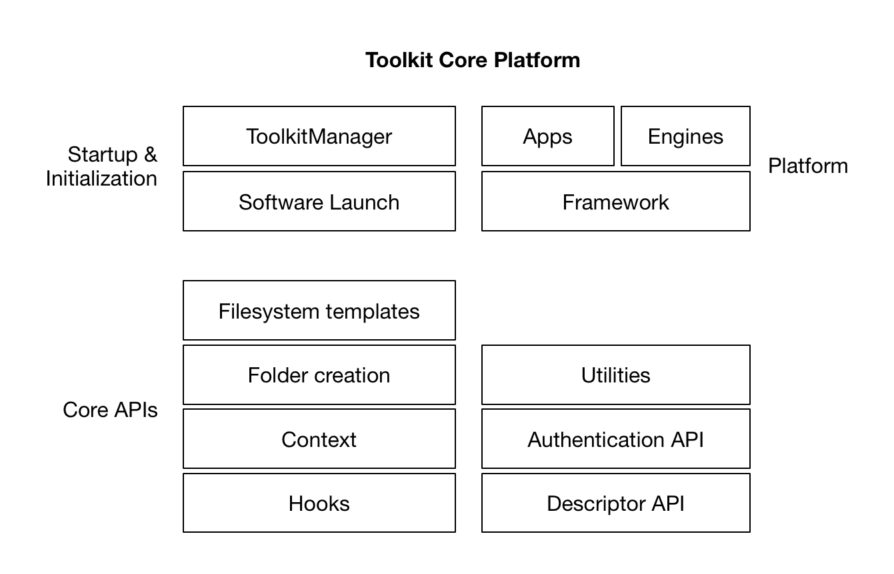

Overview
####################################################

Welcome to the Shotgun pipeline Toolkit developer and reference documentation.
Below you will find a detailed technical reference of all Toolkit Core APIs as well
as information useful for developers and engineers.

What is the Toolkit Platform?
----------------------------------------

The toolkit Core platform consists of a number of different APIs and subsystems
used to run the Shotgun toolkit platform.

The toolkit core platform includes the following systems:

- A standard Shotgun :ref:`authentication API<authentication>` which centralizes user interaction
  and persistence of authentication information.

- A :ref:`Descriptor API<descriptor>` which handles remote resource management, code and
  config and distribution and connects the Toolkit platform to
  Shotgun, the Shotgun App Store, git and other systems.

- APIs for launching applications, creating plugins and managing
  the :ref:`launch and initialization<init_and_startup>` of the Toolkit Platform.

- A set of :ref:`Core APIs<core_api>` to manage file system naming conventions,
  folder creation and management of the current work area.

- Base interfaces for Toolkit :ref:`Apps, Engines and Frameworks<sgtk_platform_docs>`.

Who is this documentation for?
----------------------------------------

This documentation is intended for **Software Engineers or TDs** who
are either developing Toolkit Apps/Engines or doing advanced integration
of Toolkit into their pipeline and workflows.

Accessing the Toolkit Core API
----------------------------------------

As with all APIs, the Toolkit Core API is a combination of public interfaces
and internal logic. We refactor and evolve the Toolkit Core code on a regular
basis and this sometimes changes to the internal structure of the code.
We  recommend only accessing Toolkit via the methods
documented in this API reference. These form the official Toolkit Core API
and will always remain backwards compatible.

As a general rule, each package in the sgtk core API imports its
full public interface. This is to provide a cleaner interface and
make refactoring easier. We therefore recommend importing from the
package level whenever possible::

    # recommended and documented API access
    from sgtk.authentication import ShotgunAuthenticator

    # we recommend *avoiding* deeper, module level imports
    from sgtk.authentication.shotgun_authenticator import ShotgunAuthenticator

