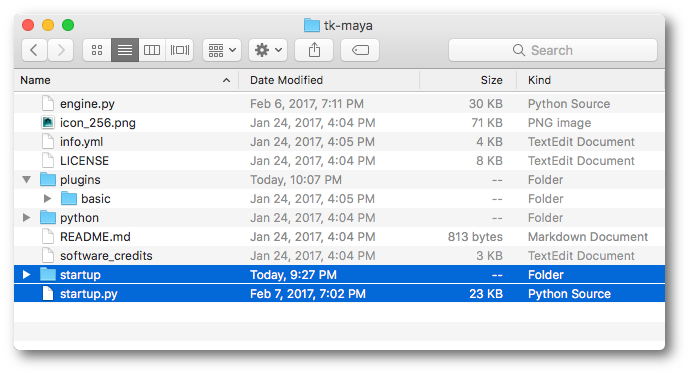
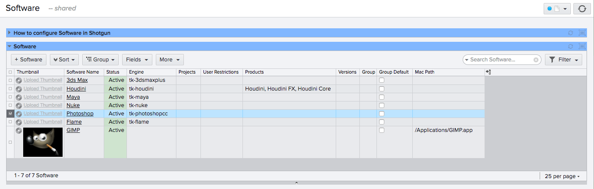
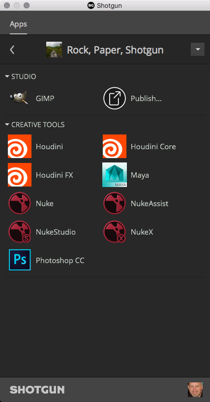

.. _sgtk_platform_docs:

.. currentmodule:: sgtk.platform

Apps, Engines and Frameworks
####################################################

This part of the API documentation covers all the classes and methods used when dealing with Engines, Apps and Frameworks.
If you are interested in developing your own apps, engines or frameworks, the base classes needed to be derived
from are outlined below. The documentation also covers how to initialize and shut down the Toolkit engine platform.

Managing Engines and Apps
---------------------------------------------------

The methods in this section are used when you want to start up or manage a Toolkit engine.
This typically happens directly once a host application (e.g. Maya or Nuke) has been launched.
A running engine typically needs to be terminated before a new engine can be started. The method
for terminating an engine can be found on the engine class itself. Methods defining a standard
interface for launching host applications are also provided.

.. autofunction:: start_engine

.. autofunction:: current_engine

.. autofunction:: get_engine_path

.. autofunction:: find_app_settings

.. autofunction:: change_context

.. autofunction:: restart

Engines
---------------------------------------

A Toolkit engine connects a runtime environment such as a DCC with the rest of the Toolkit ecosystem.
As the engine starts up, it loads the various associated apps and frameworks defined in the configuration and acts
as a host for all these objects, ensuring that they can operate in a consistent fashion across integrations.

**Information for App Developers**

If you are developing an app, you typically call out to the engine via the :meth:`Application.engine` accessor.
You use the engine for a couple of main things:

- Dialog UI creation via :meth:`Engine.show_dialog`, :meth:`Engine.show_modal` or :meth:`Engine.show_panel`

- Command registration via :meth:`Engine.register_command`

The engine acts as a bridge between the DCC and the App so that the app doesn't have to
contain DCC-specific code to create dialogs or manage menus etc. Typically, any DCC specific code
is contained within a :class:`~sgtk.Hook`, making it easy to design apps that
can be extended easily to support new engine environments.

**Information for Engine developers**

The engine is a collection of files, similar in structure to an App. It has an ``engine.py`` file and this must
derive from the :class:`Engine` Base class. Different engines then re-implement various aspect of this base
class depending on their internal complexity. A summary of functionality include:

- The base class exposes various init and destroy methods which are executed at various points in the startup
  process. These can be overridden to control startup and shutdown execution.

- The engine provides a commands dictionary containing all the command objects registered by apps.
  This is typically accessed when menu entries are created.

- Methods for displaying UI dialogs and windows can be overridden if the way the engine runs QT
  does not the default base class behavior.

The typical things an engine needs to handle are:

- Menu management. At engine startup, once the apps have been loaded, the engine needs to create
  its Shotgun menu and add the various apps to this menu.

- Logging methods are typically overridden to write to the application log.

- UI methods are typically overridden to ensure seamless integration of windows launched by Toolkit apps
  and the underlying host application window management setup. Engines are launched via the
  :meth:`stgk.platform.start_engine()` command. This command will read the configuration files,
  launch the engines, load all apps etc. The goal with the engine is that once it has launched,
  the it provides a consistent python/QT interface to the apps. Since all engines implement the
  same base class, apps can call methods on the engines to for example create UIs. It is up to each
  engine to implement these methods so that they work nicely inside the host application.

- An interface to startup DCC applications that centralizes the business logic of discovering executable
  paths, setting a proper environment for launch, and initializing toolkit integration during the launch
  phase. This is described in detail in the :ref:`Launching Software` section.

Engine Events
============================

Engines have the ability to emit events that can then be handled by Toolkit Apps. The design follows closely
that of Qt's events, where event handler methods can be implemented in a Toolkit App to execute custom
behavior tied to specific event types.

**Emitting Engine Events**

It is an engine's responsibility to monitor its host DCC application's event or signalling frameworks to
then emit its associated event. The example below is listening for a Qt signal from a host's "frontend"
handle and then emits a FileOpenEvent::

    def pre_app_init(self):
        """
        Runs before apps are initialized.
        """
        frontend.file_opened.connect(self._handle_file_open)
    
    def _handle_file_open(self, file_path):
        """
        Emits a file open event that apps can listen for.

        :param str file_path: The path of the file opened.
        """
        event = sgtk.platform.events.FileOpenEvent(file_path)
        self.log_debug("Emitting event %s..." % event)
        self._emit_event(event)

**Handling Engine Events**

Toolkit Apps can receive and handle an event in one of two ways:

- Override the type specific event handler. The advantages of this approach to event handling is that
  there is no need to type check the event before handling it, and the slight performance benefit of
  only running custom logic when an event of the type you're interested in is emitted. In the case of
  a file-open event, the Toolkit App's :meth:`Application.event_file_open` method would be reimplemented.

- Override the generic event handler. Every engine event that is emitted, regardless of type, will be
  sent to the Toolkit App's :meth:`Application.event_engine(event)` method. The approach to handling an
  engine event in this manner would be to type check the given event object using ``isinstance()`` and run
  the appropriate logic according to the results.

In the example below, the Toolkit App has reimplemented the :meth:`Application.event_file_open` method in
order to execute custom logic when the parent :class:`Engine` has indicated that a new file has been
opened by the host DCC application::

    def event_file_open(self, event):
        """
        Handles event notifications from the parent engine.

        :param event: The event object that was emitted.
        :type event: :class:`~sgtk.platform.events.FileOpenEvent`
        """
        self.engine.log_debug("Handling event: %s" % event)
        self.set_version_entity_by_file(file_path=event.file_path)

Engine
============================

.. autoclass:: Engine
    :inherited-members:
    :members:
    :exclude-members: descriptor,
                      get_child_logger,
                      get_env,
                      get_setting_from,
                      get_template_from,
                      init_engine,
                      log_metric,
                      log_user_attribute_metric,
                      settings

    **Engine Customizations**

    The following methods can be used by subclasses to customize engine
    behavior.

    .. automethod:: _create_dialog
    .. automethod:: _create_dialog_with_widget
    .. automethod:: _create_widget
    .. automethod:: _define_qt_base
    .. automethod:: _emit_event
    .. automethod:: _emit_log_message
    .. automethod:: _ensure_core_fonts_loaded
    .. automethod:: _get_dialog_parent
    .. automethod:: _initialize_dark_look_and_feel
    .. automethod:: _on_dialog_closed

    **Instance Methods & Properties**

Applications
---------------------------------------

Toolkit Apps are tools that can execute in multiple DCC environments.

.. note:: For an introduction to App development, see https://support.shotgunsoftware.com/entries/95440137

A good way to get started with App development is to clone our starter github repository
https://github.com/shotgunsoftware/tk-multi-starterapp. Please note that there are different branches
demonstrating different types of apps with a varying degree of complexity.

Application
============================

.. autoclass:: Application
    :inherited-members:
    :exclude-members: descriptor,
                      get_env,
                      get_setting_from,
                      get_template_from,
                      log_metric,
                      settings
    :members:

Frameworks
---------------------------------------

Frameworks are like libraries. They contain functionality that can be shared and reused across apps or engines.

Frameworks are automatically imported into the system whenever Toolkit finds a framework defined in the info.yml
for an app or an engine. Once imported, it will be available in the frameworks dictionary on the host object.
For example, an app or engine (or framework) may have the following definition in its info.yml::

    frameworks:
        - {"name": "tk-framework-widget", "version": "v0.1.2"}
        - {"name": "tk-framework-tools", "version": "v0.x.x"}

When Toolkit loads the app, it will verify that the two frameworks are present in the environment and
initialize them. Once initialized, the app that needs them can access them via the ``self.frameworks``
property::

    foo_bar_module = self.frameworks["tk-framework-widget"].import_module("foo_bar")

In order to import a framework module into app or engine code, use the convenience method
:meth:`~sgtk.platform.import_framework`. This method is typically executed right in the beginning
of the file, before you create any methods or classes::

    import os
    import sys
    import sgtk
    widgets = sgtk.platform.import_framework("tk-framework-widget", "widgets")

    class MyBrowser(widgets.BrowserWidget):
        ...

If you would like to load the framework instance itself rather than a module which was imported as part of
the framework initalization, you can use the :meth:`~sgtk.platform.get_framework` method::

    import sgtk
    fw = sgtk.platform.get_framework("tk-framework-widget")

Note that this only works inside of code which has been imported via the import_module command - e.g.
the way we recommend that Sgtk code is being imported into apps. For other scenarios, use the frameworks
dictionary in conjunction with the import_module command, as shown above.

Frameworks are imported in an individual fashion, meaning that even though a framework is used in two apps,
each app will import its own instance of the framework. This is to ensure stability and encapsulation.

A framework works just like an app or an engine - it has an info.yml manifest, a framework.py file which
typically contains a class which derives from the Framework base class, etc.

Framework
============================

.. autoclass:: Framework
    :inherited-members:
    :exclude-members: descriptor,
                      get_setting_from,
                      get_template_from,
                      get_env,
                      log_metric,
                      settings
    :members:

Exceptions
-----------------

The following exception types are raised from within ``sgtk.platform``:

.. autoclass:: TankEngineInitError
    :show-inheritance:
    :inherited-members:
    :members:

.. autoclass:: TankMissingEngineError
    :show-inheritance:
    :inherited-members:
    :members:

.. autoclass:: TankContextChangeNotSupportedError
    :show-inheritance:
    :inherited-members:
    :members:

Import and access methods
---------------------------------------

The following methods are useful when writing app, engine or framework code and you need to
access and load other objects.

.. note:: For examples of how the below methods are used in practice, check out
          our starter app https://github.com/shotgunsoftware/tk-multi-starterapp.

.. autofunction:: current_bundle

.. autofunction:: get_framework

.. autofunction:: import_framework

.. autofunction:: get_logger

Configuration and ``info.yml`` manifest
---------------------------------------

Apps, engines and frameworks each have a metadata file. It always resides in the root of the app or engine
and is always named ``info.yml``. This metadata file contains important information about the item:

- Configuration settings available for an app or engine.
- Display name, documentation and support links for the app and other user facing metadata.
- All custom Shotgun fields that are required by the app or engine code.
- Which frameworks that are required in order for this app to run. You can specify
  an exact framework version to use (e.g. ``v1.2.3``) or you can track against a subset of
  versions (e.g. ``v1.x.x`` or ``v1.2.x``).

For real-world examples, see for example
the `Shotgun Loader <https://github.com/shotgunsoftware/tk-multi-loader2/blob/master/info.yml>`_
or the `Shotgun Nuke Write Node <https://github.com/shotgunsoftware/tk-nuke-writenode/blob/master/info.yml>`_.

Display name and Description
====================================================

The optional ``display_name`` field defines the name that the user will see for the app.
The optional ``description`` field is a brief one line description of what the app does::

    # More verbose description of this item
    display_name: "Write Node"
    description: "Support for the Shotgun Write Node in Nuke."

Frameworks
====================================================

If a framework is being used by the app, declare it in the ``info.yml`` and Toolkit will keep track
and make sure that it is installed and available. Once inside the app, use the call
``module_name = sgtk.platform.import_framework("tk-framework-name", "module_name")``. For more
information, see :meth:`~sgtk.platform.import_framework`.

The frameworks section is a list of dictionaries, for example::

    # the frameworks required to run this app
    frameworks:
        - {"name": "tk-framework-shotgunutils", "version": "v2.x.x"}
        - {"name": "tk-framework-qtwidgets", "version": "v1.x.x"}

Version numbers are typically supplied on the form ``v1.x.x``, meaning that it will try to use
the most recent approved major version one of the framework. Toolkit uses semantic versioning
(http://semver.org/) for its versioning, meaning that major version numbers indicate breaking changes,
minor version number increments indicates added features and patch version numbers indicates backwards
compatible bug fixes. We therefore recommend to have framework dependencies track against a
major version number.

Version constraints
====================================================

If your app or engine requires specific versions of shotgun, the core or other things,
you can specify this using the three parameters ``requires_shotgun_version``, ``requires_core_version``
and (for apps only) ``requires_engine_version``::

    # Required minimum versions for this item to run
    requires_shotgun_version:
    requires_core_version: "v0.14.37"
    requires_engine_version: "v0.2.3"

Supported Engines and operating systems
====================================================

If your app is not a multi-app that has been designed to run in *any* engine, use
this option to specify which engines are supported::

    supported_engines: [tk-nuke]

If your app or engine only supports a particular operating system, you can define this
using a ``supported_platforms`` parameter. Valid values are ``linux``, ``windows`` and ``mac``.
This is an optional setting - omitting it or leaving it blank means that the app
or engine will work on all platforms.

Documentation and Support
====================================================

If you are developing an app for the Toolkit app store, no need to fill this in - the Sgtk Store
manages documentation separately! But if you are building an in-house app for your studio,
it can be useful to link it up to a wiki page or similar, so that it is easy for users to
jump straight from the app to the documentation. In this case, just add a ``documentation_url``
setting::

    documentation_url: "http://intranet/path/to/sgtk_app_docs.html"

This will be picked up and displayed in various locations in the Toolkit UI.

Similar to the documentation url above, it can be useful to connect an app to a url
which lets users know how to get help when they have questions. If you have a separate
system in your studio, (like an Request Tracker setup), and you want to make it easy for
users to reach out from the app to this system, just define a ``support_url`` url::

    support_url: "http://intranet/pipeline_team/support.html"

This setting is optional, and if left blank, the support url will automatically
be the standard Toolkit support location.

Required Context Fields
====================================================

Toolkit has a :class:`~sgtk.Context` which it uses to determine what the current Shot, Project or Asset is.
Apps may require a particular feature to be present in the context - for example, a
Loader App may require an entity to be present in order to show a list of items for the
current Asset or Shot. The ``required_context`` settings help defining what fields are needed.
Possible values are ``project``, ``entity``, ``step``, ``task`` and ``user``.

Shotgun fields
====================================================

If your app requires a particular custom field in Shotgun to operate correctly, you can add this to the
``info.yml`` manifest. Whenever the app is installed into a setup, toolkit will ensure that this custom field exists in shotgun.

Just create a ``requires_shotgun_fields`` in your manifest and add entries on the following form::

    requires_shotgun_fields:
        # Shotgun fields that this app expects
        Version:
            - { "system_name": "sg_movie_type", "type": "text" }

Note how the fields are grouped by Shotgun entity type (in the example above ``Version``). For a list of
which field types are supported,
see the `Shotgun API documentation <http://developer.shotgunsoftware.com/python-api/data_types.html>`_.

.. note:: For more complex field types (such as entity and multi entity links), you need to set up creation via
          the **post-install hook** instead. (The post install hook is a special hook which runs at installation time
          and allows you to execute arbitrary code as part of the app installation process.)

.. warning:: This functionality requires administrative privileges in Shotgun. Apps using this functionality
             therefore requires a workflow where an admin is required to update or install such apps. For general
             purpose apps, we therefore recommend not relying on this functionality.

The configuration section
====================================================

If an app requires a setting in its code, it should be defined in the info.yml.
Toolkit will validate all requested settings and make sure that they
have all been defined (or have default values) and are valid before apps are
launched. It will also use this metadata when performing upgrades and installations.

A single configuration entry typically looks like this::

    setting_name:
        type: some_type
        description: "description of the setting"
        default_value: general_default
        default_value_tk-nuke: nuke_default
        default_value_tk-maya: maya_default
        option1: option_value1
        option2: option_value2

Data types typically have specific optional settings. All data types and their options are
outlines in the following sections.

A full configuration section inside an ``info.yml`` manifest may look like this::

    configuration:

        shotgun_fields_hook:
            type: hook
            default_value: "{self}/shotgun_fields.py"
            description: Hook which controls how values are presented

        action_mappings:
            type: dict
            description: Associates shotgun objects with actions. The actions are all defined
                         inside the actions hook, so a number of actions are available by default
                         and in addition to this you can add your own actions if you like.
            default_value:
                Task:
                    - { actions: [assign_task, task_to_ip], filters: {} }
                Version:
                    - { actions: [quicktime_clipboard, sequence_clipboard], filters: {} }
                PublishedFile:
                    - { actions: [publish_clipboard], filters: {} }

            default_value_tk-nuke:
                Task:
                    - { actions: [assign_task, task_to_ip], filters: {} }
                Version:
                    - { actions: [quicktime_clipboard, sequence_clipboard], filters: {} }
                PublishedFile:
                    - { actions: [publish_clipboard], filters: {} }
                    - { actions: [read_node], filters: { published_file_type: Rendered Image} }
                    - { actions: [script_import], filters: { published_file_type: Nuke Script} }

Sparse configurations
~~~~~~~~~~~~~~~~~~~~~~~~~~~~~~~~~~~~~~~~~~~~~~~~~~~~~~~~~~~~~~~~

In the configuration you can define default value for the various app settings that you define.
As of ``v0.18.x``, these values will be read at run-time if the setting is not
specified in the environment. Prior to ``v0.18.x``, configuration files were required to be
non-sparse, meaning that all parameters needed to be populated in the configuration.

Default values per engine
~~~~~~~~~~~~~~~~~~~~~~~~~~~~~~~~~~~~~~~~~~~~~~~~~~~~~~~~~~~~~~~~

It is possible to define defaults per engine using the following syntax::

    setting_name:
        type: some_type
        description: "description of the setting"
        default_value: general_default
        default_value_tk-nuke: nuke_default
        default_value_tk-maya: maya_default

When the app is being installed or updated, toolkit will first look for a default value
for the engine which the app is being installed into. If that is not found, it will look
for a general ``default_value`` setting. If that is not found, the user will be prompted to
manually supply a value to populate in the environment. As of ``v0.18.x``,
settings with a default value will not be explicitly added to the installed/updated
app's settings.

Values that are procedurally populated by hooks
~~~~~~~~~~~~~~~~~~~~~~~~~~~~~~~~~~~~~~~~~~~~~~~~~~~~~~~~~~~~~~~~

For advanced use cases, it is possible to specify a configuration value as a special hook evaluator
rather than as a template setting. This means that when you configure your environment,
rather than specifying an actual value for a setting to use with your app, you can specify a piece of
code that returns the value to use. This makes it possible to create very complex
settings logic. For more information, see
the `example_template_hook.py hook <https://github.com/shotgunsoftware/tk-core/blob/master/hooks/example_template_hook.py>`_
located in the core hooks area.

Simple Data Types
~~~~~~~~~~~~~~~~~~~~~~~~~~~~~~~~~~~~~~~~~~~~~~~~~~~~~~~~~~~~~~~~

A number of simple data types are supported. These do not have any special options.

* ``str`` - a string value
* ``int`` - an integer
* ``float`` - a floating point value
* ``bool`` - a boolean, expecting values true or false

An example declaration for a simple data type may look like this::

    debug_logging:
        type: bool
        default_value: false
        description: Controls whether debug messages should be emitted to the logger

The config_path data type
~~~~~~~~~~~~~~~~~~~~~~~~~~~~~~~~~~~~~~~~~~~~~~~~~~~~~~~~~~~~~~~~

Use this when your app requires an external file that is part of the configuration.
Typically, this settings type is used when you want to allow for a user to associate
files with a configuration. These files can be icons or other resource files that
should be part of the configuration. These paths should always be defined without an initial
slash and using slashes as its path separator. Sgtk will translate it into a valid windows path::

    output_icon:
        type: config_path
        description: A config centric path that points to a square icon png file.

The publish_type data type
~~~~~~~~~~~~~~~~~~~~~~~~~~~~~~~~~~~~~~~~~~~~~~~~~~~~~~~~~~~~~~~~

Use this when you want a setting which expects a **Publish Type** - these are typically used
when publishing data to Shotgun. Value is a string matching ``PublishedFileType.code``::

    published_script_type:
        type: publish_type
        description: The Published file type for published Nuke scripts.

.. note:: The equivalent ``tank_type`` data type is also supported for backwards compatibility.

The shotgun_entity_type data type
~~~~~~~~~~~~~~~~~~~~~~~~~~~~~~~~~~~~~~~~~~~~~~~~~~~~~~~~~~~~~~~~

Value is a string that represents a Shotgun entity type like Task, Sequence, Shot::

    entity_type:
        type: shotgun_entity_type
        default_value: Shot
        description: "The entity type to attach to"

The shotgun_permission_group data type
~~~~~~~~~~~~~~~~~~~~~~~~~~~~~~~~~~~~~~~~~~~~~~~~~~~~~~~~~~~~~~~~

Value is a string that represents the display name of a Shotgun permission group like Admin,
Artist::

    permissions_group:
        type: shotgun_permission_group
        default_value: Artist
        description: "Permissions group to use when performing the operation"

The shotgun_filter data type
~~~~~~~~~~~~~~~~~~~~~~~~~~~~~~~~~~~~~~~~~~~~~~~~~~~~~~~~~~~~~~~~

Value is a filter that will be passed to the shotgun api when performing a query (e.g. ``["sg_status_list", "is", "cmpt"]``).
As shotgun filters can take multiple forms, no additional validation will be done on values of this type::

    publish_filters:
        type: list
        values:
            type: shotgun_filter

The template data type
~~~~~~~~~~~~~~~~~~~~~~~~~~~~~~~~~~~~~~~~~~~~~~~~~~~~~~~~~~~~~~~~

Value is a string matching an entry in ``templates.yml``. Using the fields option
you specify how Toolkit should validate the template that the user specifies::

    output_render:
        description: Render output location
        type: template
        fields: "context, name, channel, version, [width], [height], [eye]"

When you specify which fields your app requires, it must be strict. Toolkit will ensure
that the template that the user has chosen to configure the app with exactly matches the
values specified in the fields string. Typically, the app will also pull in fields
via the context object - you can specify this by using the special ``context`` parameter.
Optional parameters are represented with ``[brackets]`` and the special token ``*`` indicates
that an arbitrary number of fields is okay. For example:

* ``fields: name`` - only templates containing a single field name will be valid
* ``fields: context, name`` - templates containing exactly the number of fields that the context
  is able to resolve, and name, will be valid.
* ``fields: context, name, [width], [height]`` - same as previous but the two fields width and height
  can be present in the template at the user's discression.
* ``fields: name, *`` - name is required, the rest of the fields can be arbitrary.

A typical example illustrating the use of ``*`` is when you need to look for things in the
scene which do not belong to the current context - for example if you are working on a shot
and wants to scan for assets that have been imported into the scene. In this case, you cannot
use the context since this is pointing at the current Shot::

    input_templates_to_look_for:
        type: list
        description: List of templates to look for when scanning the scene for inputs.
                     A template listed here only needs to have a field called version. This field
                     will be used in the comparison to determine what is out of date.
        values:
            type: template
            fields: "version, *"

**Empty settings**

By default, all template settings require the user to specify a valid template when
they are added to the environment configuration. If you want to define a template
setting that can be set to ``None``, specify the **allows_empty** option and set it to True::

    output_render:
        description: Render output location, Leave blank for default output.
        type: template
        fields: "context, name, channel, version, [width], [height], [eye]"
        allows_empty: True

The hook data type
~~~~~~~~~~~~~~~~~~~~~~~~~~~~~~~~~~~~~~~~~~~~~~~~~~~~~~~~~~~~~~~~

Hooks makes it possible to create flexible and powerful configurations for toolkit apps.
A hook is a python file which contains a single class (deriving from a Hook base class or
from other hook classes) and a number of pre-defined methods.

Hooks takes configuration beyond the retrival of a simple string or int value and allows
apps to break out parts of the code that are likely to vary across facilities into
code that can be customized, either by completely overriding it or by deriving from
another hook class.

For hook documentation, see :ref:`sgtk_hook_docs`.

**Typical Workflow for hooks**

If you are using a Toolkit app and want to customize the behaviour that is defined in a hook,
you can typically follow these steps:

1. Identify the hook file and copy it into the ``hooks`` folder in your Toolkit project
   configuration. For example, if your hook is named ``validation.py``, copy it to the
   configuration folder as ``CONFIG_ROOT/hooks/validation.py``.

2. In your environment configuration, find the app config and tell the app to use your
   new file instead of the default one::

        # change the default value in your env config:
        validation_hook: {self}/validation.py

        # to this new value:
        validation_hook: {config}/validation.py

3. Now we have a bunch of duplicated code in our config folder which isn't great. Because we are inheriting
   from the default hook, our custom hook only really needs to contain the *modifications* that we are making
   and not the entire logic. So go in and strip back our custom hook in the config folder::

        # customized validation hook in CONFIG_ROOT/hooks/validation.py
        import sgtk

        HookBaseClass = sgtk.get_hook_baseclass()

        class Validator(HookBaseClass):

            def validate_string(self, value):
                # call the built-in hook that comes with the app first
                HookBaseClass.validate_string(self, value)

                # now add our extra bit of validation
                if "LOLCAT" in value:
                    raise Exception("No lol-cats in my pipeline!")

This makes it possible to customize parts of hooks, while leaving a lot of the hook code
in tact. This keeps customizations lightweight, avoids code duplication and allows an app
developer to push out bug fixes much more easily.

**Multiple levels of inheritance in hooks**

For even more complex scenarios, it is possible to declare an inheritance chain in the
environment config::

    validation_hook: {$STUDIO_ROOT}/studio_validation.py:{config}/project_validation.py.

This example will have three levels of inheritance: first the built in hook, after that a studio
level implementation defined by an environment variable and lastly a project level implementation.

**Accessing a framework inside a hook**

For even more complex hook setups, you can also access frameworks from inside your hooks::

    class SomeHook(HookBaseClass):

        def some_method(self):

            # first get a framework handle. This object is similar to an app or engine object
            fw = self.load_framework("my-framework-library_v123.x.x")

            # now just like with an app or an engine, if you want to access code in the python
            # folder, you can do import_plugin
            module = fw.import_module("some_module")

Note how we are accessing the framework instance `my-framework-library_v123.x.x` above. This needs
to be defined in the currently running environment, as part of the frameworks section::

    engines:
      # all engine and app defs here...

    frameworks:
     # define the framework that we are using in the hook
     my-framework-library_v123.x.x:
        location: {type: dev, path: /some/path}

The list data type
~~~~~~~~~~~~~~~~~~~~~~~~~~~~~~~~~~~~~~~~~~~~~~~~~~~~~~~~~~~~~~~~

Value is a list, all values in the list must be of the same data type.
You must supply values dict that describes the data type of the list items::

    entity_types:
        type: list
        values: {type: shotgun_entity_type}
        default_value: [Sequence, Shot, Asset, Task]
        description: List of Shotgun entity types where this
                     Sgtk action should be visible on the Actions menu.

Optionally you can also specify an **allows_empty** option if an empty list is a valid value::

    publish_types:
        type: list
        allows_empty: True
        values: {type: pubish_type}

You would then be able to specify an empty list in your environment configuration::

    apps:
        tk-multi-loader:
            tank_types: []

The dict data type
~~~~~~~~~~~~~~~~~~~~~~~~~~~~~~~~~~~~~~~~~~~~~~~~~~~~~~~~~~~~~~~~

Value is a dictionary, keys are always strings, values can be of mixed types.

In info.yml, optionally provide an **items** dict. Used to mark what keys must be in the config,
default values, and type info for the values which will be used for validation::

    write_nodes:
        type: list
        description: "A list of dictionaries in which you define the Sgtk write nodes that
                     are supported in this configuration."
        allows_empty: True
        values:
            type: dict
            items:
                name: { type: str }
                file_type: { type: str }
                publish_type: { type: tank_type }
                render_template:
                    type: template
                    fields: "context, name, channel, version, SEQ, [width], [height], [eye]"

A valid setting could look like this::

    movies:
    - {name: Exr Render, file_type: exr, publish_type: Quicktime, render_template: exr_shot_render}
    - {name: Dpx Render, file_type: dpx, publish_type: Quicktime, render_template: dpx_shot_render}

Launching Software
---------------------------------------------------

This section provides an overview of Toolkit standards around launching DCC software. Generally,
Toolkit exists and executes in an initialized state after a DCC application has already started up.
The software launch interface is specialized to operate outside of this known state. The interface 
is made up of three main components:  

- **Software Entity** - An entity in Shotgun used to identify local software installs to display in Launch interfaces such as Desktop and SG web
- **Core Launch Interface** - Standard methods and interfaces that provide the launch mechanism for scripts and apps such as ``tk-multi-launchapp``
- **Toolkit Engine** - Implementation of the core interface for a specific toolkit integration which includes finding installed executables, preparing the toolkit environment, and launching the DCC

A Simple Launch Application
===================================================

The Toolkit core API provides an interface that custom applications can use to implement the business
logic for launching DCC software related to a particular Toolkit engine. This interface is comprised
of a factory method :meth:`~sgtk.platform.create_engine_launcher` and classes :class:`SoftwareLauncher`,
:class:`SoftwareVersion`, and :class:`LaunchInformation`. The factory method is called for a specific
engine in the environment configuration and returns a SoftwareLauncher subclass instance implemented
by that engine.

Methods on the launcher instance can be used to determine which versions of the DCC
are installed on the local filesystem and the proper environment, including command line arguments,
required for a successful launch.

The following lines of python code demonstrate how to launch Maya using the core interface::

    import subprocess
    import sgtk
    
    # Create a Toolkit Core API instance based on a project path or
    # path that points directly at a pipeline configuration.
    tk = sgtk.sgtk_from_path("/site/project_root")
    
    # Specify the context the DCC will be started up in.
    context = tk.context_from_path("/site/project_root/sequences/AAA/ABC/Light/work")
    
    # Using a core factory method, construct a SoftwareLauncher
    # subclass for the desired tk engine.
    software_launcher = sgtk.platform.create_engine_launcher(tk, context, "tk-maya")
     
    # Use the SoftwareLauncher instance to find a list of Maya versions installed on the 
    # local filesystem. A list of SoftwareVersion instances is returned.
    software_versions = software_launcher.get_supported_software()
     
    # Ask the SoftwareLauncher instance to prepare an environment to launch Maya in.
    # For simplicity, use the first version returned from the list of software_versions.
    # A LaunchInformation instance is returned from the call to prepare_launch().
    extra_command_line_args = ""
    file_to_open_on_startup = "/site/project_root/sequences/AAA/ABC/Light/work/scene.ma"
    launch_info = software_launcher.prepare_launch(software_versions[0].path, extra_command_line_args, file_to_open_on_startup)
     
    # Launch Maya!
    launch_command = "%s %s" % (launch_info.path, launch_info.args)
    subprocess.Popen([launch_command], env=launch_info.environment)

More robust launch applications can utilize :ref:`Configuration Using the Software Entity in Shotgun`
to determine information about DCCs that are available to launch.

Engine Implementation
===================================================

To plug into the core API software launch interface, a Toolkit engine must implement a subclass of
:class:`SoftwareLauncher` in a ``startup.py`` file at the engine root level, analogous to the
``engine.py`` file.

For the classic tooklit scenario, scripts required by the engine to prepare the launch environment
or initialize the engine once the DCC has started up typically reside under a sibiling ``startup``
directory:

Since the launch logic for the engine is invoked while the engine is not actually running, the
:class:`~SoftwareLauncher` base class provides functionality similar to the :class:`~Engine` base
class. Two SoftwareLauncher methods that *must* be implemented by an engine are :meth:`~SoftwareLauncher.scan_software`
and :meth:`~SoftwareLauncher.prepare_launch`.

The ``scan_software`` method is responsible for discovering the executable paths for the related DCC
installed on the local filesystem and returns a list of :class:`SoftwareVersion` instances representing
the executables found.

The ``prepare_launch`` method establishes the environment to launch the DCC in, confirms the correct
executable path to launch, and supplies command line arguments required for launch. This method returns a
:class:`LaunchInformation` instance that contains all information required to successfully launch the
DCC and startup the engine integration.

To recap, a skeleton ``startup.py`` file for the Maya engine contains the following::

    from sgtk.platform import SoftwareLauncher, SoftwareVersion, LaunchInformation

    class MayaLauncher(SoftwareLauncher):
        def scan_software(self):
            # Construct a list of SoftwareVersion instances representing executable versions of the DCC
            # installed on the local filesystem.
            software_versions = []
            ...
            return software_versions

        def prepare_launch(self, exec_path, args, file_to_open=None):
            # Construct an environment to launch the DCC in, confirm the correct executable path to
            # launch, and provide required command line args. Return this information as a
            # LaunchInformation instance.
            correct_executable_path = ""
            command_line_args = ""
            launch_environment = {}
            ...
            launch_information = LaunchInformation(correct_executable_path, command_line_args, launch_environment)
            return launch_information

Starting the Engine on DCC Launch: Classic vs. TaaP
~~~~~~~~~~~~~~~~~~~~~~~~~~~~~~~~~~~~~~~~~~~~~~~~~~~

The engine implementation of :meth:`~SoftwareLauncher.prepare_launch` should be able to handle
starting the engine during the DCC launch phase in either Classic or Toolkit as a Plugin mode.

In Classic mode, environment variables for the engine name (SGTK_ENGINE) and current context (SGTK_CONTEXT)
are set and a startup script calling :meth:`~sgtk.platform.start_engine` with those values parsed
from the environment is registered with the DCC.

For plugin mode, values for required environment variables are set and a startup script to load the plugin(s)
is registered with the DCC. Which mode to use at runtime is controlled by the ``launch_builtin_plugins`` engine
configuration setting. If the resolved setting value is an empty list, Classic mode is invoked. Otherwise, the
list of plugins will be loaded.

For either case, the :meth:`~SoftwareLauncher.prepare_launch` method must assure the paths to ``sgtk`` and any
startup files are specified in the ``PYTHONPATH`` environment variable. It is also considered good practice to
account for the name of a file to open on launch in the environment (e.g. SGTK_FILE_TO_OPEN).

.. note:: How to initialize and runs code at startup will vary from DCC to DCC. The supported toolkit engines for Maya, Nuke, and Houdini are good reference implementations.

.. note:: When setting an environment variable containing the current context value, be sure to use a serialized version of the context to encode login information in the shell.

To put this into practice, here is ``tk-maya``'s implementation of prepare_launch()::

    import sgtk
    from sgtk.platform import SoftwareLauncher, SoftwareVersion, LaunchInformation

    class MayaLauncher(SoftwareLauncher):
        ...
        def prepare_launch(self, exec_path, args, file_to_open=None):
        """
        Prepares an environment to launch Maya in that will automatically
        load Toolkit and the tk-maya engine when Maya starts.
        :param str exec_path: Path to Maya executable to launch.
        :param str args: Command line arguments as strings.
        :param str file_to_open: (optional) Full path name of a file to open on launch.
        :returns: :class:`LaunchInformation` instance
        """
        required_env = {}

        # Run the engine's userSetup.py file when Maya starts up
        # by appending it to the env PYTHONPATH.
        startup_path = os.path.join(self.disk_location, "startup")
        sgtk.util.append_path_to_env_var("PYTHONPATH", startup_path)
        required_env["PYTHONPATH"] = os.environ["PYTHONPATH"]

        # Check the engine settings to see whether any plugins have been
        # specified to load.
        find_plugins = self.get_setting("launch_builtin_plugins")
        if find_plugins:
            # Parse the specified comma-separated list of plugins
            self.logger.debug(
                "Plugins found from 'launch_builtin_plugins': %s" % find_plugins
            )

            # Keep track of the specific list of Toolkit plugins to load when
            # launching Maya. This list is passed through the environment and
            # used by the startup/userSetup.py file.
            load_maya_plugins = []

            # Add Toolkit plugins to load to the MAYA_MODULE_PATH environment
            # variable so the Maya loadPlugin command can find them.
            maya_module_paths = os.environ.get("MAYA_MODULE_PATH") or []
            if maya_module_paths:
                maya_module_paths = maya_module_paths.split(os.pathsep)

            for find_plugin in find_plugins:
                load_plugin = os.path.join(
                    self.disk_location, "plugins", find_plugin
                )
                if os.path.exists(load_plugin):
                    # If the plugin path exists, add it to the list of MAYA_MODULE_PATHS
                    # so Maya can find it and to the list of SGTK_LOAD_MAYA_PLUGINS so
                    # the startup's userSetup.py file knows what plugins to load.
                    self.logger.debug("Preparing to launch builtin plugin '%s'" % load_plugin)
                    load_maya_plugins.append(load_plugin)
                    if load_plugin not in maya_module_paths:
                        maya_module_paths.append(load_plugin)
                else:
                    # Report the missing plugin directory
                    self.logger.warning(
                        "Resolved plugin path '%s' does not exist!" %
                        load_plugin
                    )

            # Add MAYA_MODULE_PATH and SGTK_LOAD_MAYA_PLUGINS to the launch
            # environment.
            required_env["MAYA_MODULE_PATH"] = os.pathsep.join(maya_module_paths)
            required_env["SGTK_LOAD_MAYA_PLUGINS"] = os.pathsep.join(load_maya_plugins)

            # Add context and site info
            std_env = self.get_standard_plugin_environment()
            required_env.update(std_env)

        else:
            # Prepare the launch environment with variables required by the
            # classic bootstrap approach.
            self.logger.info("Preparing Maya Launch via Toolkit Classic methodology ...")
            required_env["SGTK_ENGINE"] = self.engine_name
            required_env["SGTK_CONTEXT"] = sgtk.context.serialize(self.context)

        if file_to_open:
            # Add the file name to open to the launch environment
            required_env["SGTK_FILE_TO_OPEN"] = file_to_open

        return LaunchInformation(exec_path, args, required_env)

Configuration Using the Software Entity in Shotgun
===================================================

Software entities are used to specify and configure locally installed DCC applications that are 
launchable from Toolkit and/or Shotgun for a user on the site. They are readable by all users, but
only writeable by admins.

The ``tk-multi-launchapp`` Toolkit application (installed by default with Desktop and available in
the App Store for download) parses the site Software entries to determine which launch commands to
present in Desktop for a specific Project and user. At minimum, a ``Software Name`` and ``Engine``
for DCCs that have Toolkit integrations or ``<platform> Path`` for those that do not must be specified
for a launch command to be added to Desktop. The full list of launch commands a user has access to
may be limited by Project, user name, Group membership, or DCC version.

The Software site page can be accessed from either "All Pages > Global Pages > Software" or "User Menu >
Admin > Software" menus.

.. note:: Since the engine field is optional, any locally installed DCC application can be registered to launch by specifying a ``Software Name``, ``<platform> Path``, and ``Thumbnail``. A proper Toolkit integration for this DCC is not required.

Software Entity Field Reference
~~~~~~~~~~~~~~~~~~~~~~~~~~~~~~~~~~~~~~~~~~~~~~~~~~~

- **Thumbnail** (``image`` ``[url``) - Icon to use for Desktop launch command. If no thumbnail is uploaded, the corresponding Toolkit engine (if specified) will attempt to load one from the resolved DCC application bundle.  In auto discovery mode*, this value will be overridden by the SoftwareVersion.icon value, unless no icon is found for the DCC.
- **Software Name** (``code`` ``[text]``) - Menu name to use for Desktop launch command. In auto discovery mode*, this value will be overridden by the SoftwareVersion.display_name value.
- **Status List** (``sg_status_list`` ``[status list]``) - Active (act) or Disabled (dis). These are the same status values applicable to HumanUsers.
- **Engine** (``engine`` ``[text]``) - Toolkit engine to construct a SoftwareLauncher instance for and startup on application launch. If specified, the Shotgun Panel and other related Toolkit applications will be available to the user once the DCC has finished loading. The engine may be able to locate corresponding application executables and/or icons in the case all platform path and/or thumbnail fields are left blank. This field may be left blank to launch DCC applications that do not have a Toolkit integration implemented.
- **Projects** (``projects`` ``[multi-entity:Project]``) - List of Projects to restrict launch commands generated by this Software entity to. If no Projects are specified, then the resulting  launch command(s) will be displayed for all Projects.
- **Users (User Restrictions)** (``user_restrictions`` ``[multi-entity:HumanUser|Group]``) - List of Groups and/or HumanUsers launch commands generated by this Software entity are restricted to. If no Groups or HumanUsers are specified, then the resulting launch commands will be visible to all Groups and HumanUsers.
- **Products** (``products`` ``[text]``) - Comma separated list of strings representing project names relevant to DCC applications to create launch commands for. If not specified, all products will be searched for. A product string is DCC-specific but could be something like : ``“Houdini FX, Houdini Core, Houdini”``
- **Versions** (``versions`` ``[text]``) - Comma separated list of specific DCC application versions to create launch commands for. If any of the specified versions are not found locally installed, then a launch command will not be created for those versions. Conversely, launch commands will not be constructed for locally installed DCC versions that do not appear in this list.  This field may be left empty to register launch commands for all available versions of a DCC.
- **Group** (``group`` ``[text]``) - Group name launch commands for this Software entity belong to.  This value is interpreted by the engine the commands are being registered with. For example, in Desktop all launch commands generated for this Software entity will appear as drop-down menu items of a button with this name on a Project window.
- **Group Default** (``group_default`` ``[checkbox]``) - If a single launch command is generated by this Software entity and a ``group`` value has been specified, this field value indicates whether to launch this command if the group is selected instead of an individual command. This value is ignored if more than one launch command is generated for this Software entity, and the command with the highest version is used as the default instead.  This value is interpreted by the engine the commands are being registered with.
- **Linux Path / Mac Path / Windows Path** (``linux_path`` / ``mac_path`` / ``windows_path`` ``[text]``) - DCC application executable path or name to launch on the specified platform (linux, mac, or windows). The specified path may contain environment and/or configuration variables. If no applicaion path or name is given, the corresponding Toolkit engine (if specified) will attempt to create launch commands for ALL versions of the DCC application found installed on the local file system. The list of commands generated bay be limited by the contents of the ``versions`` field
- **Linux Args / Mac Args / Windows Args** (``linux_args`` / ``mac_args`` / ``windows_args`` ``[text]``) - Command line options to pass to the DCC as it is being launched.

SoftwareLauncher
---------------------------------------------------

This section contains the techincal documentation for the core classes and methods described in the
:ref:`Launching Software` section above. 

.. autofunction:: create_engine_launcher

.. autoclass:: SoftwareLauncher
    :exclude-members: descriptor,
                      settings
    :members:

SoftwareVersion
============================
.. autoclass:: SoftwareVersion
    :members:

LaunchInformation
============================
.. autoclass:: LaunchInformation
    :members:

Using QT inside your Toolkit App
---------------------------------------

You can use QT classes inside your app code. Sgtk will handle the import and gracefully manage different
platform considerations in the background. Typically, PySide is being used for QT integration, but Sgtk
may use PyQT in certain engines. Normally, the code is pretty portable between the two systems and it
should be no problem writing code that works with both libraries.

In order to use QT, import it from Sgtk::

    from sgtk.platform.qt import QtCore, QtGui

Toolkit will make sure Qt is sourced in the correct way. Keep in mind that many applications (for example Nuke)
may not have a functional Qt that can be imported when they run in batch mode.

Using QT 5 inside your Toolkit App
---------------------------------------

When running in an environment with PySide 2 , Toolkit will provide under ``sgtk.platform.qt`` an
emulation layer that mimics the PySide 1 API on top of PySide 2 so that your Toolkit applications don't
need to be updated to work in those environments. If you need straight access to the PySide 2 API, you
can access it through the ``sgtk.platform.qt5`` module. Detecting the availability of Qt 5 can be done
through :meth:`Engine.has_qt5`.

.. warning:: The PySide 1 emulation layer for PySide 2 may be missing some features. It provides enough
             coverage to run the officially supported Toolkit applications. If you find that something
             in the PySide 1 emulation layer is not working or missing, please contact support@shotgunsoftware.com
             so that we may update it.

             To learn more about API discrepancies between Qt 4 and Qt 5, you can visit
             https://wiki.qt.io/Transition_from_Qt_4.x_to_Qt5.

Creating Dialogs
========================================

When creating a dialog, it is important to parent it properly to the host environment. There is nothing stopping
you from managing this by yourself, but for maximum compatibility and portabilty, we strongly suggest that you l
et Toolkit handle it. When using Sgtk to set up your UI, just let your UI class derive from QtGui.QWidget and pass
it to one of the UI factory methods that the engine has. For example::

    from sgtk.platform.qt import QtCore, QtGui

    # derive from QtGui.QWidget for your UI components.

    class AppDialog(QtGui.QWidget):

        def __init__(self, param1, param2):
            QtGui.QWidget.__init__(self)

    # the engine is then used to correctly launch this dialog. In your app code
    # you can now do create a window using the engine's factory methods.

    # display widget in a modeless window:
    widget_obj = self.engine.show_dialog("Dialog Title", self, AppDialog, param1, param2)

    # display widget in a modal dialog - blocking call
    (return_code, widget_obj) = self.engine.show_modal("Dialog Title", self, AppDialog, param1, param2)

What happens in the above calls is that your app widget is parented inside of a Dialog window Sgtk is creating.
Sgtk will add additional potential window constructs, menus etc. Whenever the app widget is closed (for example
using the close() method), the parent window that is used to wrap the widget will automatically close too.

Modal dialogs and exit codes
========================================

If you want to run your widget as a modal dialog, it may be useful to signal success or failure.
This is normally done in QT using the methods QDialog.accepted() and QDialog.rejected(), however since the app
widget typically derives from QWidget, these methods are not available. Instead, Sgtk will look for a member
property called ``exit_code``. Typically, your code for a modal dialog would look something like this::

        def on_ok_button_clicked(self):
            # user clicked ok
            self.exit_code = QtGui.QDialog.Accepted
            self.close()

        def on_cancel_button_clicked(self):
            # user clicked cancel
            self.exit_code = QtGui.QDialog.Rejected
            self.close()

The call to self.engine.show_modal() will return the appropriate status code depending on which button was clicked.

Hiding the default Toolkit title bar
========================================

By default, the standard Toolkit UI dialog includes a title bar at the top. However, sometimes this is not desirable,
especially when the contained widget is quite small. To hide the title bar, just add a property called
``hide_tk_title_bar`` to your widget class and set it to a value of True, for example::

    class MyWidget(QtGui.QWidget):

        @property
        def hide_tk_title_bar(self):
            return True

        def __init__(self):
            ...

Software launching
==================

.. autoclass:: SoftwareLauncher
  :members:
  :exclude-members: descriptor,
                    settings

  The following methods can be used by subclasses to help implement :meth:`scan_software`.

  .. automethod:: _is_supported
  .. automethod:: _glob_and_match

.. autoclass:: SoftwareVersion
  :members:
